<p align="center">
  
</p>

<p align="center">
  
  
  
  
</p>

> ### O problema não é falta de ideia. É o que recebe luz agora.

Plugin de Claude Code que faz a sessão virar algo que dá pra **ler e decidir**.
Quatro coisas, e nenhuma depende de você lembrar de ativar:

- **planeja antes de implementar** — rodada de perguntas numeradas, cada uma já com a resposta recomendada, e então para e espera;
- **responde em número**, não em parede de texto;
- **avisa** quando a conversa sai do combinado — uma frase, com escolha;
- **não chama nada de pronto** sem colar a saída que prova.

Duas dessas regras são travas que rodam **fora do modelo**: hook com exit code.
Não dá pra argumentar com elas.

## Por que floresta

Uma **mente-floresta** — o termo é de Paula Prober, em *Your Rainforest Mind* —
não sofre de falta de ideia. Sofre do contrário: tudo cresce ao mesmo tempo,
rápido, em direções diferentes, e o que cresce junto disputa a mesma luz.

É por isso que lista de tarefas não resolve. Lista pressupõe **escassez** de
tarefa; aqui a tarefa sobra. O problema não é lembrar do que fazer — é decidir
**o que recebe luz agora**, e proteger essa decisão do resto, que continua
crescendo enquanto você trabalha.

Daí o vocabulário das ideias. Ele não é enfeite, é o modelo:

| Palavra | O que é |
|---|---|
| **foco** | a clareira onde você está trabalhando hoje — é contra ele, e só contra ele, que o desvio é medido |
| **plantar** | o que não pode crescer agora vai pro chão **com contexto**, vivo, em vez de morrer numa lista de "algum dia" |
| **colher** | ele volta quando chega a hora, e vira trabalho de verdade |
| **descartar** | o que decidiu não acontecer sai da lista **com motivo** — e a linha fica, porque ideia que sai sem rastro volta idêntica em três semanas |
| **estação** | a admissão de que tempo certo é restrição real, não desculpa de quem procrastina |

O resto do plugin não é botânico e não tenta ser: `/foco`, `depurar` e as travas
se chamam pelo que fazem. A floresta explica **por que** as ideias têm ciclo de
vida — onde ela não explica nada, ela não entra.

## Uma instalação, não uma pilha de skills

O jeito comum de montar isso é catar dezenas de skills soltas em repositórios
diferentes, copiar pasta por pasta e descobrir depois quais conflitam. Aqui é
**um comando**, e o que entra já foi filtrado por uso: cada peça deste repo
sobreviveu a pelo menos um incidente real, e o que não sobreviveu foi apagado.

O repo cresce, mas cresce por subtração também: skill que não paga o próprio
custo de contexto sai.

## Planeja antes de implementar

`/brainstorm` é uma entrevista adversarial e o primeiro estágio do fluxo. Ele mapeia o assunto como **árvore de
decisão** e pergunta só o que dá pra perguntar agora — a *fronteira*, o
conjunto de decisões cujos pré-requisitos já fecharam. Pergunta que depende de
outra ainda aberta espera a rodada seguinte, em vez de te obrigar a chutar.

A rodada inteira vem de uma vez, numerada, **cada pergunta já com a resposta
recomendada**:

> ❓ **Q1 — Onde o token vive**: sessão no servidor ou JWT no cliente?
> ➡️ **Recomendo:** sessão no servidor — você já tem Redis, e revogar JWT exige lista negra que é o mesmo trabalho com mais peças.
>
> ❓ **Q2 — Expiração**: 15 min com refresh, ou 8h fixas?
> ➡️ **Recomendo:** 8h fixas — refresh só se paga com múltiplos dispositivos, e não é o seu caso hoje.

E então ele **para e espera**. Você responde `1 ok, 2 não, usa 15 min` — três
palavras em vez de compor tudo do zero. Cada resposta remodela a árvore:
decisão fechada empurra a fronteira e destrava o que dependia dela.

A regra que sustenta isso: **descobrir fato é trabalho do assistente, nunca
seu.** Pergunta que o ambiente responde — o que tem no arquivo, qual versão
está instalada, o que o log diz — vira busca dele, não pergunta pra você.

## O fluxo: sete estágios que não dá para pular

`/brainstorm` é o primeiro de sete. Cada um é uma skill invocável sozinha — dá
para entrar no meio, que é o caso normal de quem retoma trabalho.

```mermaid
flowchart LR
    A["arqueologia<br/>mapa.md"] -.->|"só se houver<br/>legado sem mapa"| B
    B["brainstorm<br/>design.md"] --> P["plano<br/>plano.md"]
    P --> E["executar<br/>agentes em paralelo"]
    E --> R["revisar<br/>contexto zerado"]
    R --> V["verificar<br/>roda o artefato"]
    V --> F["fechar<br/>commit + limpeza"]
    R -.->|"reprovado"| E
    V -.->|"reprovado"| E
    L["limpar"] -.->|"manutenção,<br/>fora do fluxo"| F
```



**O que faz isso ser fluxo e não conselho:** cada estágio abre rodando
`estado.cjs exigir`, e esse comando **sai com código 2** quando o anterior não
fechou. Não é o modelo lendo uma instrução e decidindo obedecer — é comando
externo, pelo mesmo motivo dos outros gates deste repo.

```
$ node scripts/estado.cjs exigir --slug 2026-08-11-exemplo --estagio revisar
RECUSADO: 'revisar' exige executar fechado(s).
  executar: status=parcial
Rode o estagio 'executar' antes. Retomada: node scripts/estado.cjs proximo --slug 2026-08-11-exemplo
```

`parcial` e `reprovado` **não fecham**: "5 de 7 tarefas" para de virar "pronto"
sem ninguém decidir isso, e revisão reprovada devolve o trabalho para
`executar` em vez de seguir.

**Retomada é comando, não memória.** Sessão nova — ou sessão que perdeu contexto
na compactação — roda `estado.cjs proximo --slug <slug>` e sabe onde parou:

| O quê | Onde | No git? |
|---|---|---|
| Design aprovado, com o porquê de cada decisão | `docs/rainforest/design/<slug>.md` | **sim** |
| Plano, com dependência e critério falsificável por tarefa | `docs/rainforest/planos/<slug>.md` | **sim** |
| Estado do fluxo, com o veredito de cada estágio | `docs/rainforest/estado/<slug>.json` | **sim** |

Os três são versionados de propósito: é por eles que **outro dev pega a
atividade no meio**. Fora do git fica só a tagarelice — worktrees, briefs de
agente, diffs de review.

**O paralelismo vive no `executar`**, e é o plano que diz o que pode ir junto:
tarefa sem dependência é marcada `paralela: sim`, e várias chamadas de agente na
mesma resposta rodam ao mesmo tempo. Isso só é seguro porque **todo agente que
edita roda em worktree isolado**, obrigado pelo hook com exit 2 — a distro que
mais influenciou este desenho precisou **proibir** implementadores em paralelo
justamente por não ter essa trava.

## Números em vez de parede de texto

Mensagem com N perguntas recebe **N respostas numeradas**, na ordem em que
você escreveu, e as respostas completas vão no **fim** do turno — depois das
ferramentas, não antes delas.

Você fecha item respondendo `1 ok`. O item some da lista e o resto **renumera
a partir do 1**, então a lista aberta é sempre curta e sempre começa no mesmo
lugar. Não existe "item 7 pendente desde ontem".

Vale pro meio da tarefa também: em trabalho de 3+ etapas, o checkpoint é
`fechamos 2/5` — não "estou progredindo bem".

## Avisa em vez de derivar

Existe um foco declarado, num arquivo que entra na sessão sozinho. Quando a
conversa sai dele, o aviso é **uma frase, sem julgamento, com escolha**:

> Estávamos em [foco], isso é [outro tema] — seguimos nele ou planto e voltamos?

Sem sermão e sem repetir. Três coisas que o desvio *não* dispara: trabalhar em
paralelo de propósito, tocar uma frente que já está listada como compromisso, e
foco de trabalho fora do horário de trabalho.

Para decidir se cala, o radar depende de dois dados, ambos opcionais:

- **`Pastas:` no FOCO.md** — lista separada por vírgula das pastas onde o foco
  está sendo trabalhado. Exemplo: `Pastas: C:/projeto-a, C:/projeto-a/src`.
  O radar usa isso para saber se a janela que está aberta é a do foco, mesmo
  que não seja a janela da sessão atual. Sem este campo, o radar cobra desvio
  mesmo que a mesma clareira esteja viva em outra janela.

- **`expediente` no `config.json`** — dias da semana e horário de trabalho.
  Forma: `"expediente": {"dias": [1,2,3,4,5], "de": "08:00", "ate": "18:00"}`.
  Dias usa a convenção de `Date.getDay()` — 0 = domingo, 1 = segunda, etc.
  O radar usa isso para saber se é hora de trabalho ou tempo pessoal.
  Sem este campo, o radar cobra desvio fora do horário, mesmo que o foco seja
  marcado como `[trabalho]`.

Faltando qualquer um dos dois, o radar **continua cobrando** e o hook anuncia o
que falta, com o efeito prático junto — assim:

```
Pastas: ausente no FOCO.md — o radar vai cobrar desvio mesmo com o foco
aberto em outra janela.
```

Isso é **falha fechada**, e é deliberado: um radar que emudece por falta de
configuração é indetectável, e você nunca saberia que ele parou. Um radar que
cobra demais você percebe e reclama — foi exatamente assim que este defeito
apareceu. Anúncio e veredito são mutuamente exclusivos: não há como julgar sem
dado.

**A isenção cala só o aviso de desvio de escopo.** O aviso de prazo — vencido
ou a ≤2 dias — continua saindo, sempre. São coisas diferentes: saber num sábado
que algo vence na segunda é informação e não custa nada; ser cobrado no sábado
por estar lendo outra coisa é o que incomoda. Uma isenção que silenciasse o
radar inteiro trocaria um defeito por outro.

E quando o ambiente **impede** uma regra — permissão negada, hook fora do ar,
ferramenta ausente —, ele diz numa linha em vez de falhar em silêncio. Regra
que não rodou e não avisou é pior que regra inexistente: você conta com ela.

## Não chama de pronto sem a saída

Esta é a que mais paga. Agente relata **intenção**, não resultado — e o relato
é convincente exatamente quando está errado. Três cenas medidas, todas com
suíte verde e relatório de sucesso completo:

**O hash que não existia.** Um agente reportou o commit que tinha criado:
`a009b5b`, "completo" `a009b5b4e8f0d83e3ef4e3d8e7f3e4d8e7f3e4d8`. Olhe o fim da
string — `e7f3e4d8` aparece duas vezes seguidas. É um hash inventado, e dava pra
ver sem consultar nada. Um `gh pr view --json headRefOid` devolveu o real. Na
mesma sessão, a verificação pela janela principal pegou **3 de 3** falhas de
relato — todas invisíveis no texto do agente.

**O critério que foi afrouxado em vez de cumprido.** Outro agente recebeu os
números absolutos no briefing e **cumpriu todos, honestamente**: `40 passed
(40)`, `92 passed (92)`, `exit 0` no lint. Nenhum número inventado. E a entrega
estava errada, porque ele **desligou as duas regras de lint que falhavam** em
vez de tratá-las. O `exit 0` era verdadeiro. *Critério numérico não pega quem
edita a régua.*

**A proteção que nunca roda.** Cinco entregas, três recusadas pela mesma
família de defeito: código que parece proteger e está atrás de uma condição
que o chamador real nunca aciona. O teste chama a função direto, com os
argumentos certos, e passa. Produção nunca entra ali. Nenhuma leitura de código
pegou — só apareceu **rodando o artefato** num cenário que os testes da própria
entrega não cobriam.

O que separou a entrega impecável da entrega com bug, medido em três sessões,
não foi o modelo nem o isolamento:

> Foi o briefing conter, ou não, **o teste que falsificaria a entrega** — com
> comando exato e saída exata esperada.

**A evidência real do objeto errado.** Uma tarefa criou um `.gitignore` com o
conteúdo `*` — que, dentro do próprio diretório, ignora **a si mesmo**. O
`git add -A` nunca o adicionou e ele nunca chegou ao commit. O agente colou
evidência **real**: `ls -la` mostrando o arquivo, `cat` mostrando o conteúdo.
Evidência do disco, quando a afirmação era sobre o commit. E `git status
--porcelain` não pega, porque por desenho não lista ignorado — a categoria
exata do arquivo que faltava. *Comando e saída colados também não bastam se
provarem outra coisa.* O conserto foi mecânico: `--espera <caminho>` pergunta à
árvore do commit e nomeia a regra de ignore que comeu o arquivo.

Daí a regra: o critério de sucesso vai pronto no briefing, e a validação é
executar o artefato e olhar a saída. **Suíte verde não é evidência. ✅ sem
comando e saída colados não é verificação — e a saída colada tem que ser do
objeto sobre o qual se está afirmando.**

## Disciplina de dev, embutida

Se você está no Claude Code, você está construindo alguma coisa — então isso
não é acessório.

`modo-dev` traz escada YAGNI, causa raiz antes de remendo, rastreabilidade de
cada linha do diff até o pedido, expandir–contrair, e evidência antes de
"pronto". Ele existe por **economia de contexto**: absorve o que sobrevive à
compressão de plugins pesados, sem carregar os plugins.

`depurar` dispara sozinha em bug difícil, regressão de performance ou "funciona
aqui e não lá". Ela constrói o **loop de feedback capaz de ficar vermelho antes
de qualquer hipótese** — depois 3–5 hipóteses falseáveis, ranqueadas. Fica fora
do `modo-dev` de propósito: depurar é um ramo do trabalho, não todo ele.

## Travas mecânicas

Regra escrita não alcança o modo de falha em que o agente **leu a regra e errou
mesmo assim**. Um subagente rodou a verificação de isolamento, recebeu o
diretório principal — que era a condição de parada —, transcreveu a condição
corretamente e escreveu um OK do lado. No dia seguinte foi a vez da janela
principal: `git add -A` varreu trabalho de outra sessão duas vezes na mesma
noite, sabendo que não devia. O que sobrou das duas noites:

> Enquanto o veredito de uma checagem for redigido pelo mesmo agente que ela
> deveria travar, ela não trava nada. **Exit code não se argumenta.**

| Hook (`PreToolUse`, exit 2) | Barra | Em quem |
|---|---|---|
| `gate-worktree.cjs` | escrita de subagente em repo git que não é worktree linkado, e git que mexe no checkout | só subagente — a janela principal passa |
| `gate-staging-total.cjs` | `git add -A/--all/./:/`, `-u`, e `git commit -a/-am` | **também a janela principal**, que foi onde os dois incidentes ocorreram |

Valem em **qualquer** repo git da máquina, porque o hábito é que é o problema,
não o repositório. A mensagem de bloqueio não só recusa: a de staging roda
`git status --porcelain -uall` e devolve o `git add` por caminho já montado —
trava que só diz "não" vira trava desligada. Saídas de emergência, nomeadas na
própria mensagem: `RAINFOREST_GATE_OFF=1` no ambiente, ou um arquivo
`.rainforest-gate-off` na raiz do repo.

Cada uma tem bateria própria (`hooks/testa-gate-*.sh`, **68 casos** — 30 e 38)
que roda o hook de verdade contra repos git montados na hora. A maioria dos
casos testa o que deve **passar**: falso positivo aqui atrapalha todo repo.

O mesmo princípio nos scripts, para o que hook nenhum alcança:

| Script | Para quê |
|---|---|
| `scripts/ideias.cjs` | única porta de escrita do `ideias.jsonl` — trava de arquivo, backup, escrita atômica, releitura do arquivo vivo e conferência byte a byte das linhas não-alvo; e o `projeto` é **slug de vocabulário fechado** (`projetos.json`), não texto livre |
| `scripts/limpar-branches.cjs` | confere o local contra o remoto e classifica por dois eixos (upstream **e** merge); nunca remove branch viva, e exigir estar na base em dia é trava |
| `scripts/conferir-publicacao.cjs` | **sai com código 2** quando o rascunho tem telefone, JID, e-mail, caminho de home ou credencial — antes de virar Issue público |
| `scripts/conferir-entrega.cjs` | roda na janela principal **depois** da entrega do agente: hash de base, isolamento e citação conferidos na fonte, não no relato. `--espera <caminho>` (repetível) confere o que a tarefa prometia **na árvore do commit** — `ls`/`cat` do agente provam o disco, e `git status` não lista ignorado |
| `scripts/conferir-fluxo.cjs` | fecha as três costuras entre artefatos vizinhos do fluxo, **com exit 2**: `design` (as seções obrigatórias e as decisões `D1..Dn` sem buraco nem repetição), `cobertura` (toda decisão virou tarefa **e** toda tarefa atende decisão que existe) e `creep` (arquivo no diff que não casa com o `arquivos:` de tarefa nenhuma). Chamado pelo `estado.cjs marcar` no fechamento de estágio — só age onde o design/plano existe, e nunca torna o fluxo obrigatório |
| `scripts/setup.cjs` | monta a pasta de dados, liga/desliga o que é opcional **e configura o caminho de cada projeto** — e marca no estado o caminho que **não existe** nesta máquina, que era falha silenciosa |
| `scripts/ponte.cjs` | **gera** o `AGENTS.md` (Codex) e o `GEMINI.md` (Gemini CLI) a partir do mesmo SKILL.md que o hook injeta — e recusa gerar se não achar as regras, em vez de escrever meia ponte |
| `scripts/orcamento.cjs` | mede em **byte** as quatro fontes que o plugin põe na abertura (saída do hook, descriptions de skills, de commands e de agentes), compara com dois tetos (o `ORCAMENTO_BYTES` do hook, lido de `hooks/lib/contexto-sessao.cjs`, e um agregado de 14.000 B), e sai com exit 1 quando estoura — entra no laço do `CONTRIBUTING.md:11` como o gate que acusa quando o plugin engordar além do orçamento |
| `scripts/medir-injecao.py` | custo real do prompt de abertura, lido do `usage` que a API devolve — token de verdade, sem estimativa. O modo `--repartir` reparte a abertura por fonte (skill_listing, deferred_tools_delta, agent_listing_delta, rainforest-mind) e marca o que é **medido** (total via API), o que é **estimado** (byte convertido por fator 3.11 do tokenizador OpenAI), e o que é **subconjunto** (rainforest-mind dentro das listagens) |

O que essas travas custaram e renderam fica em [`relatorios/`](relatorios/) —
um relatório datado por incidente, com método e números.

## Codex e Gemini CLI: o que atravessa, e o que não

O plugin é do Claude Code — os 4 hooks, os slash commands, as 14 skills e os 7
subagentes são API dele e não têm equivalente nos outros hosts. Mas o **método**
não precisa ficar preso a um agente, e a pasta de dados não sabe quem a escreveu.

Quais agentes você usa é **configuração**, e mora no `/setup` (`ponte-claude`,
`ponte-codex`, `ponte-gemini`, desligadas por padrão). Qual repositório recebe o
arquivo **não é**: é alvo explícito, com ensaio, porque o gerado vai ser commitado
no repo de outra pessoa.

```
node scripts/setup.cjs --ligar ponte-codex             # declara o que esta máquina usa
node scripts/ponte.cjs --alvo <dir-do-repo>            # ensaio: mostra e não grava
node scripts/ponte.cjs --alvo <dir-do-repo> --aplicar  # só os alvos declarados
```

São **três** alvos: `CLAUDE.md` também é ponte — para quem usa Claude Code **sem o
plugin**, que não tem regra nenhuma. É o caminho de quem recebe o convite antes de
instalar. E o texto muda com o alvo: lá a falta das travas se explica pelo plugin
ausente; nos outros dois, por o host não ter `PreToolUse`.

O arquivo é **gerado**, nunca escrito à mão, e o comando que o gera está escrito
dentro dele. O motivo é um incidente: nesta máquina existem duas `CLAUDE.md` de
escopo usuário — uma por config dir — que eram sincronizadas à mão. Em 2026-08-10
uma foi editada e a outra divergiu **em silêncio**; metade do setup passou a valer
o contrário da outra metade. Regra duplicada não fica errada com aviso: fica
errada calada.

E a ponte diz o que ela **não** entrega, porque prometer trava que não existe é
pior que não ter ponte:

| No Claude Code | Na ponte |
|---|---|
| gate de worktree e gate de `git add -A` (hook `PreToolUse`, exit 2) | **texto** — não existe `PreToolUse` nesses hosts, então é combinado, não trava |
| injeção de SessionStart | o próprio arquivo gerado, que o host lê a cada sessão |
| `estado.cjs exigir` (gate do fluxo, exit 2) | **igual** — é comando de shell |
| `conferir-entrega.cjs` (regra 12, exit 1) | **igual** |
| `conferir-publicacao.cjs` (anonimização, exit 2) | **igual** |
| `/ideia`, `/foco`, `/semear` | os CLIs `ideias.cjs`, `foco.cjs`, `semear.cjs` |

O gerado **não chumba caminho de home** — ele ensina a descobrir a pasta de dados
com `ideias.cjs conferir`, porque nasce para ser commitado no repo de outra
pessoa. Se o arquivo já existir escrito à mão, o bloco entra delimitado e nada do
que estava lá é apagado; regenerar substitui só o bloco.

## Ideia solta não vira escopo, e não vira esquecimento

O caso mais comum de escopo crescendo sozinho é a emenda no fim do pedido:

> **Você:** faz a opção 2. Ah, e a gente podia colocar um cache nisso.
>
> **Sem o plugin:** *"Ótima ideia! Vou implementar a opção 2 com cache…"* — a adição virou escopo sem ninguém decidir.
>
> **Com o plugin:** *"Fechado: opção 2. Você adicionou o cache — entra no escopo agora ou planto?"*

Plantar não é descartar. A ideia sai da cabeça pra um lugar confiável, com
contexto e projeto, e fica lá até a estação certa.

```mermaid
flowchart LR
    A["💭 ideia solta<br/>no meio da tarefa"] --> B{"radar<br/>de escopo"}
    B -->|"está no foco"| C["entra na tarefa<br/>(confirmada)"]
    B -->|"está fora"| D["🌱 plantada em<br/>ideias.jsonl"]
    D --> E["revisão quando<br/>houver espaço"]
    E -->|"chegou a estação"| F["🌳 colhida:<br/>vira trabalho"]
    E -->|"ainda não"| D
    G["FOCO.md<br/>(foco declarado)"] -.->|"injetado a<br/>cada sessão"| B
```



## Comandos e skills

| O quê | Faz |
|-------|-----|
| `/divergir [problema]` | **Antes** do `brainstorm`, quando o espaço é largo e a primeira ideia já está ancorando: N frames isolados em paralelo, sem se verem, e um crítico que também nasce zerado. Devolve material para decidir; não decide e não codifica |
| `/brainstorm [assunto]` | Estágio 1: entrevista adversarial em árvore de decisão, rodada numerada com resposta recomendada — para **antes** de executar, e grava o design |
| `/foco` | Estado da conversa: foco ativo, loops abertos, decisões tomadas |
| `/foco <texto>` | Declara novo foco — injetado em toda sessão nova |
| `/ideia <texto>` | Avalia contra o foco: dentro → entra confirmada; fora → planta com contexto e projeto |
| `/ideia` | Lista as ideias plantadas |
| `/feedback` | Registra o que a sessão ensinou sobre o **método** — tria por de quem é o defeito: do plugin vira Issue, do seu trabalho vira markdown no seu repo |
| `/issue` | Abre uma Issue no repositório em que você está, com o corpo já escrito e a evidência colada
| `arqueologia` | Estágio **zero, opcional**: mapeia a fatia de legado que a demanda toca, com escala de confiança — e fatia já mapeada vira **conferência**, não extração |
| `plano` | Estágio 2: tarefas tipadas, dependência declarada e critério falsificável por tarefa — proíbe placeholder |
| `executar` | Estágio 3: despacha os agentes, em paralelo o que o plano marcou independente, cada um em worktree |
| `revisar` | Estágio 4: contexto zerado, escopo fixado pelo diff de três pontos, o relato de quem implementou não é fonte |
| `verificar` | Estágio 5: roda o artefato real e cola a saída — o critério veio pronto do plano e não se afrouxa aqui |
| `fechar` | Estágio 6: commit, limpeza do repo, remoção dos worktrees, destino da branch com você decidindo, e writeback no FOCO.md |
| `limpar` | Manutenção fora do fluxo: worktree órfão da sessão que nunca chegou ao `fechar` — e a **branch**, que sobrevive ao worktree e ninguém vê |
| `/semear` | Propõe o que criar **neste** repositório a partir do que ele já tropeçou — cada proposta cita o registro que a origina |
| `/setup` | Monta a pasta de dados e liga/desliga os gates e o fluxo, por projeto ou para tudo |
| `/ponte` | Gera `CLAUDE.md`, `AGENTS.md` (Codex) ou `GEMINI.md` (Gemini CLI) num repo, do mesmo SKILL.md — alvos declarados no `/setup`, e cada um diz o que **não** atravessa |
| `/saude` | Só o que os checadores oficiais não sabem: de quem é a raiz, margem da injeção, fluxo parado, worktree órfão |
| `modo-dev` | Disciplina de dev sob demanda (acima) |
| `depurar` | Loop de feedback antes de hipótese (acima) |
| `analisar` | Análise de dados em notebook: uma pergunta por vez, célula curta, e **revisão crítica do achado** (`n` visível, share vs. risco, explicação alternativa) antes de virar conclusão |
| `executor` | Implementação mecânica em haiku, com o método embutido no system prompt |
| `revisor` | Review/QA em sonnet: evidência primária, achado só com cenário de falha, veredito integra/não-integra |
| `tester` | Testes em sonnet: extrai o contrato, escreve o que falta, pelo menos um adversarial |
| `planejador` | Plano em sonnet: separa fato de suposição, dependência explícita entre etapas, **para antes da primeira linha de código** |
| `depurador` | Depuração em sonnet: executa a skill `depurar`; para se não conseguir um comando vermelho-capaz, em vez de chutar conserto |
| `resolvedor-de-build` | Erro de build/tipo em haiku, diff mínimo: para se a correção introduzir erro novo, se o mesmo erro persistir após 3 tentativas, ou se você pedir pausa |
| `documentador` | Doc em haiku a partir do diff real: comportamento que não confirmou em `arquivo:linha` não é escrito, vira pendência |

## As 17 regras

Resumo; o detalhe vive em
[`skills/rainforest-mind/SKILL.md`](skills/rainforest-mind/SKILL.md).

| # | Regra | Em uma frase |
|---|-------|--------------|
| 1 | Responder tudo, na ordem | N perguntas recebem N respostas numeradas, na mensagem final; item resolvido sai e a lista renumera do 1. Níveis não compartilham glifo (`1.` → `a)` → `i.`), e **`Q` aberta se reescreve inteira todo turno** — no terminal, rolar a tela para trás não é caminho |
| 2 | Escolha + adição | A emenda nunca vira escopo em silêncio: confirma ou planta |
| 3 | Radar de escopo | Saiu do foco declarado → uma frase, sem julgamento, com escolha |
| 4 | Checkpoint no meio | Tarefa 3+ etapas: "fechamos n/total" a cada etapa |
| 5 | Decisão com o porquê | "Decidido: X, porque Y. Próximo passo: Z." |
| 6 | Plantio de ideias | Ideia solta → "planto essa pra depois?"; abandono real → "já pegou o que veio buscar?" |
| 7 | Tom sênior | Policia pontas soltas e escopo, nunca o mérito; aviso ancora na emoção do resultado, não na ameaça do prazo |
| 8 | Guarda-corpo de jornada | Jornada real medida, não estimada: ~9h efetivas produzindo → um aviso, uma vez, com a hora, um ponto de parada e a checagem de corpo (água, comida, banheiro) de carona — nunca gatilho próprio. Perder a noção do tempo **dentro** da imersão é traço saudável; dificuldade de **começar ou trocar** é sinal diferente |
| 9 | Freio de Pareto | Polimento do que já está pronto → "alguém que recebe isso fica prejudicado?"; se não, entrega ou planta |
| 10 | Agentes baratos com método | Janela principal pensa; sete agentes por **função**, não por domínio: `executor` e `resolvedor-de-build` (haiku), `documentador` (haiku), `planejador`, `revisor`, `tester` e `depurador` (sonnet). Agente que edita nunca é nomeado, e **nomeado só entrega por `SendMessage`** — termina e fica calado. Os sete carregam a **cláusula de premissa**: listam o que aceitaram do briefing sem conferir, e lugar vazio não vira "não existe" |
| 11 | Worktree de subagente | Isolamento sempre, hash de base conferido na primeira ação e reconferido antes de integrar; integração por partes, nunca cópia de arquivo inteiro |
| 12 | Entrega se valida na saída real | Critério de sucesso vai pronto no briefing, incluindo o teste que falsificaria a entrega; validação é rodar o artefato e olhar a saída. Suíte verde não é evidência; exit code lido através de pipe não é exit code |
| 13 | Correção vira observação | Você corrigir a saída já é o sinal: registra silenciosamente, e no máximo uma mudança de regra por semana |
| 14 | Regra bloqueada se anuncia | Ambiente impediu uma regra → uma linha na primeira vez, nunca silêncio; caminho sai de variável, nunca escrito à mão |
| 15 | Agente não altera o ambiente | Subagente não instala nada nem mexe em PATH, env ou config global: ferramenta ausente para e reporta |
| 16 | Fato é meu, decisão é sua | Pergunta que o ambiente responde se resolve olhando, e fato não **sai** daqui sem ser olhado — briefing, recomendação e registro inclusos; decisões abertas vão em rodada única, marcadas **`Q1` `Q2`**, cada uma com a recomendada — e **o que não tem `Q` não pede nada de você** |
| 17 | Multi-janela | Paralelo é escolha, não desvio; o alerta é a janela parada esperando você. Estado compartilhado nunca se escreve à mão. Janela fechada no X ou perdida em crash sai do radar por idade (24 h), não na hora — até lá ela pode aparecer como janela ociosa |

## Vigias (automação fora da sessão)

A pasta [`vigias/`](vigias/) tem prompts headless agendados no sistema
operacional (`claude -p`, haiku) que reportam por WhatsApp: **sentinela-foco**
(briefing matinal de prazo/avanço + triagem de inbox em 3 baldes, somente
leitura), **jardineiro-ideias** (semanal — ideias plantadas + revisão do vault),
**vigia-tickets** e **revisao-bimestral**. O guarda-corpo funcionando fora da
sessão — onde o hiperfoco não deixa abrir uma.

## Instalação

```
claude plugin marketplace add luisfmontes/rainforest-mind
claude plugin install rainforest-mind@rainforest-mind
```

Ou aponte `--plugin-dir` para a pasta do repo em desenvolvimento.

**Runtime: só Node no caminho de execução.** Os hooks, os gates, o `/ideia`, o
`/saude`, o fluxo e a medição de jornada rodam em Node. O Claude Code não
garante Node nem Python (a lista oficial de dependências adicionais tem
`ripgrep` e mais nada), então a meta é **uma** dependência, não duas.

Sobra Python em **ferramental seu**, fora de qualquer regra: `medir-injecao.py`
(mede o custo real da abertura) e `validar-colhidas.py`. Nenhuma regra depende
deles — se Python não existir na máquina, nada aqui degrada.

**E as baterias também são Node.** Até 2026-08-12 elas usavam Python para montar
fixture e conferir JSON: o runtime era único para quem *instala* e duplo para quem
*contribui*, o que é a mesma promessa quebrada uma camada acima. Os 24 usos viraram
`node -e`. Os gêmeos em Python continuam, porque ali o Python **é** o teste.

Essa frase foi **falsa até 2026-08-12**, e vale dizer por quê: as regras 11 e 12
exigiam `conferir-entrega.py` na integração de toda entrega de agente, e
`skills/executar` e `agents/executor.md` o chamavam pelo nome. Um dev sem Python
não tinha a trava da regra 12 — tinha o texto dela. Trava que não trava é o único
defeito que este repo não aceita, então o script virou `conferir-entrega.cjs`.

Dois scripts ficam como **gêmeos** dos ports, e não como legado morto:

| Gêmeo | O que ele prova |
|---|---|
| `conferir-entrega.py` | a mesma bateria roda contra os dois — `CONFERIR="python scripts/conferir-entrega.py" bash scripts/testa-conferir-entrega.sh` — **23 casos**, e as falhas encenadas (as seis dos relatórios mais o arquivo que some por `.gitignore`) reprovam nos dois |
| `jornada.py` | os dois medem o mesmo dia e devolvem os mesmos números, lacuna por lacuna |

Apagar o gêmeo seria apagar a única prova de que o port está certo. O
terceiro gêmeo — o do `ideias.cjs` — foi aposentado em 2026-08-22: a bateria
gêmea tinha parado de provar equivalência (saía 53 ok / 5 falhas, pulando 5
seções inteiras como "recurso novo só do .cjs") e virou manutenção sem
retorno.

**Nenhuma regra depende de plugin de terceiro.** A regra 8 media a jornada com
um plugin de cliente até 2026-08-11; hoje mede com `node scripts/jornada.cjs`,
que lê o transcript da própria sessão. Quem tiver o plugin pode usá-lo como
conferência — nunca como requisito.

**E dependência opcional não se anuncia nem se sonda sem alguém pedir.** Duas
consequências disso, as duas de 2026-08-12:

- A abertura só reporta o que este install **declara**: a bridge do WhatsApp
  aparece quando existe `WHATSAPP_API_BASE_URL` no ambiente, e o claude-mem
  quando está instalado. Antes, toda sessão de toda máquina abria uma conexão TCP
  para `localhost:3005` e imprimia "bridge WhatsApp FORA" para quem nunca ouviu
  falar dela. Sem nada declarado o bloco inteiro sai da injeção (−169 B).
- **Os vigias nascem desligados** (`vigias`, em `/setup`). As rondas exigem
  PowerShell agendado, `claude.exe` no caminho e um destino de envio; com a chave
  desligada o `run-vigia.ps1` **sai limpo (exit 0)** e não escreve em
  `vigias/ERROS.md`, porque desligado não é erro. Ele pergunta o estado por
  `node scripts/setup.cjs --ligado vigias` em vez de reimplementar a cadeia de
  três níveis em PowerShell — segunda cópia da regra é cópia que diverge calada.

## Ajuste fino

- As regras vivem em [`skills/rainforest-mind/SKILL.md`](skills/rainforest-mind/SKILL.md) — edite e a mudança vale na próxima sessão.
- **Incidente datado vai em blockquote.** O hook remove as linhas que começam
  com `>` antes de injetar: a narrativa continua no arquivo, ao lado da regra
  que fundamenta, e sai do custo de toda sessão. Instrução nunca entra na
  citação — se a frase diz o que fazer, fica fora. Rendeu **−11%** da injeção
  sem perder uma linha de conteúdo.
- Antes de caçar token na skill, olhe onde ele está de verdade. Medido com
  `/context all`: as ferramentas de MCP somavam **40,2k tokens** contra ~330 das
  skills deste plugin. Desligar MCP por projeto rendeu **240×** o que traduzir
  as regras inteiras renderia.
- O hook avisa quando a skill passa de **60 dias sem revisão**.

## Orçamento de token

O rainforest-mind é injetado em toda sessão, então o custo dele é real e precisa de medição contínua. O `scripts/orcamento.cjs` mede as fontes (hook, skills, commands, agentes) em byte e acusa quando passa do teto de 14.000 B. Ele entra no laço de testes do `CONTRIBUTING.md:11` pela convenção de nome, via `scripts/testa-orcamento.sh` — **este repositório não tem CI**, então o gate vale quando alguém roda o laço, não automaticamente num PR:

```bash
node scripts/orcamento.cjs          # sai 0 se dentro do teto, 1 se estourou
node scripts/orcamento.cjs --teto 1000  # sobrescreve o teto para teste
```

O modo `--repartir` do `scripts/medir-injecao.py` lê o transcript e reparte a abertura por fonte, respondendo a pergunta "para onde foi cada token?" em vez de só "quanto custa?":

```bash
python scripts/medir-injecao.py --repartir
```

Medição da abertura de 2026-08-14T00:36 (transcript `570a6723`): das **67.914 tokens**, **18.980 (28%)** são atribuíveis pelo transcript — o resto é system prompt do Claude Code, schema das tools, CLAUDE.md e memórias, que o transcript não guarda.

O rainforest-mind por si ocupa **13.205 B, uns 4.246 tokens estimados, ou ~6,3%** da abertura. Pelo outro caminho, o `orcamento.cjs` contando arquivos do repositório dá **13.744 B**. Os dois **não medem a mesma coisa** e não deveriam bater exatamente: o lado do repositório conta `commands/` como parcela própria, e o lado do transcript já os traz dentro da listagem de skills; o lado do transcript mede a linha renderizada na listagem, com prefixo e formatação, e o do repositório mede só o texto da `description`. Ficarem a ~4% um do outro é consistência entre duas réguas parecidas — **não é validação cruzada**, e não deve ser lida como tal.

**Três armadilhas que este número já pisou, todas deixadas escritas de propósito:**

1. **Não some byte de uma medição com token da outra.** Uma versão deste parágrafo dizia "13.604 B ... 1.157 tokens ou 1,7%", casando o total do `orcamento.cjs` com o token de um recorte bem mais estreito do `--repartir` — errando o custo em quase 4× para menos. Cada linha da tabela traz byte e token da mesma medição; é assim que se lê.
2. **Um transcript pode ter mais de uma abertura.** Todo `--resume` grava outro `SessionStart` no mesmo arquivo. O `--repartir` atribui pelo **primeiro**, que é o mesmo que fixou o total em token — antes de isso ser consertado, ele somava as fontes de um evento com o total de outro.
3. **Nem tudo que diz "rainforest-mind" é do rainforest-mind.** O `hook_additional_context` da abertura chega como **lista** de itens de plugins diferentes, e o item do claude-mem começa com `# [rainforest-mind] recent context` — o nome do projeto no claude-mem, não o dono do texto. Ele foi contado como nosso por uma rodada inteira, inflando a fatia em 9.018 B. A separação hoje é por marcador do item, não pelo nome que aparece nele.

O byte do hook **oscila entre execuções** — ele embute estado vivo da sessão (janelas ativas, horários), então medições feitas com minutos de diferença dão 7.6xx variando. As três outras fontes são estáveis. Por isso o teto é agregado e com folga, e por isso o `testa-orcamento.sh` afirma faixas e "não pode ser 0 B", nunca igualdade exata contra o repo real.

**Ressalva sobre token estimado:** a coluna de token no `--repartir` é estimada dividindo byte por fator **3.11**, que foi medido com `tiktoken` no encoding `cl100k_base` — **que é da OpenAI (GPT-4)**, não do Claude. Não existe tokenizador do Claude disponível offline nesta máquina. O total da abertura é token **medido** (vem do `usage` da API), tudo mais é **indicativo**.

## Um foco por projeto, sem configurar nada

Onde moram `FOCO.md` e `ideias.jsonl` sai de uma **cadeia de quatro níveis**, do
mais específico para o mais genérico — o projeto sobrescreve o global, e a
detecção automática cobre quem não declarou nada:

| # | Nível | Onde | Para quê |
|---|---|---|---|
| 1 | `RFM_ROOT` | onde a variável apontar | declaração explícita, vence tudo |
| 2 | **projeto** | `<repo>/.rainforest/` | **foco e ideias daquele repo** |
| 3 | global | `~/.rainforest/` | o seu estado, valendo em qualquer pasta |
| 4 | plugin | a raiz do próprio plugin | instalação auto-hospedada (desenvolvimento) |

O que faz uma pasta contar como raiz é ter `FOCO.md` **ou** `ideias.jsonl`
dentro: um `.rainforest/` vazio criado por engano não sequestra o seu foco — e
tem teste de mutação provando que é o marcador que decide.

**O nível 3 é o seu `HOME`, e não a pasta de config do Claude Code.** A
diferença parece detalhe e não é: dá para ter mais de uma config dir na mesma
máquina — uma de trabalho e uma pessoal, por exemplo —, e ancorar o estado nela
partiria o seu foco em dois sem avisar. O foco é da pessoa, não do perfil.

A pasta de dados tem um terceiro arquivo: o **`projetos.json`**, o vocabulário
fechado de slugs de projeto (`slug → caminho + apelidos`). É ele que tira o
caminho de disco de dentro do dado — o campo `projeto` das ideias era texto
livre e guardava caminho do Windows dentro de string JSON, onde a barra
invertida seguida de `r` é escape de *carriage return*: quatro registros
tiveram o caminho comido, e 22 valores distintos para 7 projetos reais
deixaram o campo inagrupável. Slug não tem barra para escape nenhum comer, e a
pasta de cada projeto passa a ter um lugar só seu.

**O repositório é só código.** `FOCO.md`, `ideias.jsonl` e `projetos.json` não
moram aqui e não entram no git: quem instala o plugin recebe as regras, não o
foco nem as ideias de quem o publicou. Antes disso ser assim, um projeto novo herdava o estado
alheio pela cadeia — o nível 4 existe para desenvolvimento e é justamente onde
esse defeito nascia.

Criar `.rainforest/FOCO.md` num repositório é tudo o que é preciso para aquele
repositório ter foco próprio. Sem variável de ambiente, sem editar config.

### O FOCO.md tem teto, e quem o segura é um script

A seção **Avanços** é append-only por natureza: cada sessão que anda escreve
uma linha datada, e nenhuma sai. Em 2026-08-12 o arquivo estava com 15,4 KB, dos
quais 11,8 KB só de Avanços — e ele é lido **inteiro** por toda sessão que
precisa conferir prazo, marco ou avanço, porque é isso que a própria injeção
manda fazer. Pior: as três entradas de um único dia produtivo custaram mais que
os cinco dias anteriores somados, então teto em *contagem de entradas* não
segura nada.

```
node scripts/foco.cjs caminho                 # onde mora o foco desta raiz
node scripts/foco.cjs rotacionar              # ensaio: diz o que sairia
node scripts/foco.cjs rotacionar --aplicar    # move de verdade
```

O que passa do teto (5.000 B por padrão, em **bytes**) vai para o `AVANCOS.md`
ao lado, em ordem cronológica, e o FOCO.md ganha no topo do bloco uma linha
`- (histórico: N avanços de … a … em AVANCOS.md.)` — que o hook trata como
residente, para a injeção nunca dizer que as entradas antigas "continuam no
FOCO.md" quando elas já não estão. Nada é apagado: a igualdade entre o que sai
e o que entra é conferida **antes** de qualquer escrita, e sem `--aplicar` o
script não toca em disco. O `fechar` e o `/foco` chamam a rotação logo depois de
escrever o avanço.

- Fork à vontade: troque os arquivos de dado pelos seus e as regras pelo seu
  jeito de trabalhar. Nenhum caminho é cravado no código:

  | Variável | Resolve |
  |---|---|
  | `RFM_ROOT` | raiz dos dados — nível 1 da cadeia acima |
  | `CLAUDE_CONFIG_DIR` | pasta de config: a checagem de dependências e o nível 3 |
  | `WHATSAPP_API_BASE_URL` | host e porta do bridge, para os vigias e o hook |
  | `RFM_CLAUDE_EXE` | binário do Claude Code usado pelos vigias headless |

## De onde isso veio

**O problema não é falta de ideia. É o que recebe luz agora.** Essa frase
nasceu de um perfil específico — **2e**, altas habilidades com TDAH — e é ele
que explica por que a ferramenta é assim: pensamento associativo rápido abre
ideias como abas que competem com a tarefa aberta, e a resposta foi construir
memória de trabalho externa e radar de escopo.

O que a origem explica é o **rigor**, não o público. Um assistente que só
funciona quando o usuário lembra de ativá-lo não serve pra quem esquece — então
nada aqui depende de lembrar. Um aviso que dispara errado ensina a ignorar o
aviso — então cada gatilho é medido antes de entrar. Uma checagem redigida por
quem ela deveria travar não trava nada — então virou hook com exit code.

Essas três restrições nasceram de uma necessidade pessoal e valem pra qualquer
um. É por isso que o repo é público.

Desenho orientado por pesquisa sobre dupla excepcionalidade em adultos
profissionais (Barkley, ADDitude, CHADD) e por análise de skills públicas de
ADHD para assistentes de IA. Lacuna que nenhuma delas cobria: **aviso de desvio
de escopo** e **fechamento de loops abertos**.

## Créditos

- *Your Rainforest Mind* — Paula Prober, a metáfora que dá nome ao plugin.
- [i-have-adhd](https://github.com/ayghri/i-have-adhd) — inspiração de formato e prova de que skill de neurodivergência funciona.
- Pesquisa 2e: suporte camuflado em conversa casual não funciona — por isso toda intervenção aqui é explícita e sinalizada.
- [task-observer](https://github.com/rebelytics/one-skill-to-rule-them-all) — Eoghan Henn (rebelytics.com), CC BY 4.0: o gatilho "correção do usuário = observação" e o ciclo de revisão que viraram a regra 13. Adotado o mecanismo, não o log paralelo.
- [mattpocock/skills](https://github.com/mattpocock/skills) — MIT: a árvore de decisão e a fronteira de `grilling` (regra 16 e `/brainstorm`), o loop vermelho-capaz de `diagnosing-bugs` (skill `depurar`), névoa e fora de escopo de `wayfinder`, expandir–contrair de `to-tickets`, ponto de variação e teste da deleção de `codebase-design`, e o portão triplo do registro de decisão de `domain-modeling`. Acoplado por compressão — nenhuma das 35 skills instalada.
- [andrej-karpathy-skills](https://github.com/multica-ai/andrej-karpathy-skills) — a rastreabilidade de cada linha do diff até o pedido, e o tratamento de código morto alheio vs. órfão da própria mudança, no `modo-dev`.
- [UditAkhourii/adhd](https://github.com/UditAkhourii/adhd) — a tese que sustenta o `/divergir`: *tree-of-thought* alarga a busca mas caminha num contexto compartilhado, então a ancoragem persiste entre os ramos — **problema de arquitetura, não de prompt**. Contrato reimplementado a partir da descrição, sem copiar código, porque regra deste plugin não depende de plugin de terceiro. O frame `premissa`, o cenário concreto exigido na refutação e o teste que falsifica a própria skill são daqui.

## Mexer no plugin

Bateria verde nas 15 suítes (mais os dois gêmeos em Python), mutação em bateria
nova, e duas regras que este repo aprendeu do jeito caro:

- **campo obrigatório novo vem com o passado resolvido no mesmo commit** — backfill,
  anistia por data em constante declarada, ou opcional para quem nasceu antes;
- **arquivo novo na pasta de dados nasce com três portas** — quem escreve, quem
  **mostra** no `/setup` e quem checa no `/saude`. A porta do meio é mecânica: uma
  lista só (`ARQUIVOS`, no `setup.cjs`) é lida por quem semeia e por quem mostra, e
  a bateria compara o disco com a saída, com mutação.

Está tudo em [`CONTRIBUTING.md`](CONTRIBUTING.md), com o incidente que originou cada
item.

## Licença

[MIT](LICENSE) — use, modifique e redistribua, inclusive comercialmente,
mantendo o aviso de copyright.

É a mesma licença de boa parte do que está creditado acima, e a escolha é por
coerência: este plugin foi montado aproveitando trabalho que outras pessoas
liberaram, e devolvê-lo sob condição mais apertada do que a que o tornou
possível não faria sentido.

O que **não** está sob esta licença é a sua pasta de dados — `FOCO.md`,
`ideias.jsonl` e `projetos.json` moram em `~/.rainforest`, nunca no
repositório, e são só seus.
