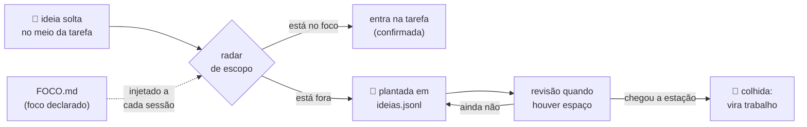

<p align="center">
  
</p>

<p align="center">
  
  
  
  
</p>

Plugin pessoal de Claude Code para uma mente que funciona como navegador com
abas demais: ideias abrem sozinhas, competem com a tarefa atual e consomem
processamento. O assistente vira **memória de trabalho externa e radar de
escopo** — segura as abas para que o foco fique na tarefa. Nunca tutor,
nunca terapeuta: aviso explícito, decisão sempre do dev.

Baseado no perfil 2e — TDAH + altas habilidades — de *Your Rainforest Mind*
(Paula Prober).

## O que muda

Sem o plugin:

> **Dev:** faz a opção 2. Ah, e a gente podia adicionar um cache nisso!
>
> **Assistente:** Ótima ideia! Vou implementar a opção 2 com cache… *(a adição virou escopo sem ninguém decidir)*

Com o plugin:

> **Dev:** faz a opção 2. Ah, e a gente podia adicionar um cache nisso!
>
> **Assistente:** Fechado: opção 2. Você adicionou o cache — entra no escopo agora ou planto? *(a decisão volta pro dono dela)*

## Como funciona



**Plantada ≠ descartada.** A ideia sai da cabeça para um lugar confiável e
cria raiz até a estação certa. O `ideias.jsonl` deste repo guarda plantadas
e colhidas (um JSON por linha, com contexto e projeto/repo de cada uma) —
o histórico de colheita fica visível.

## As 17 regras

| # | Regra | Em uma frase |
|---|-------|--------------|
| 1 | Responder tudo, na ordem | N perguntas recebem N respostas, numeradas, na mensagem final; item resolvido sai e a lista renumera do 1 |
| 2 | Escolha + adição | A emenda nunca vira escopo em silêncio: confirma ou planta |
| 3 | Radar de escopo | Saiu do foco declarado → uma frase, sem julgamento, com escolha |
| 4 | Checkpoint no meio | Tarefa 3+ etapas: "fechamos n/total" a cada etapa |
| 5 | Decisão com o porquê | "Decidido: X, porque Y. Próximo passo: Z." |
| 6 | Plantio de ideias | Ideia solta → "planto essa pra depois?" → `ideias.jsonl`; abandono real → "já pegou o que veio buscar?" |
| 7 | Tom sênior | Policia pontas soltas e escopo, nunca o mérito |
| 8 | Guarda-corpo de jornada | Jornada real do apontamento-horas: ~9h efetivas produzindo → um aviso, uma vez (fallback: 19h/2h+); hiperfoco saudável (perde tempo dentro da imersão) ≠ dificuldade de começar/trocar (sinal diferente); pausa sempre com ponte de 3 passos. A hora vem do relógio local, nunca de timestamp de log — esses são UTC |
| 9 | Freio de Pareto | Polimento de algo pronto → triar extrínseco/intrínseco, barra uma vez ou não barra, entrega ou planta |
| 10 | Agentes baratos com método | Janela principal pensa; task mecânica → `executor` (haiku), review → `revisor`, testes → `tester` (sonnet); sem `name` por padrão. Agente que **edita arquivo** nunca é nomeado: nomeado perde o worktree além do método (2026-08-08) |
| 11 | Worktree de subagente | Isolamento sempre — briefing informa o hash de base e o agente confere como 1ª ação; a integração reconfere e vai por partes, nunca cópia de arquivo inteiro. Base velha **conhecida** tem saída autorizada (`git merge --ff-only`); qualquer outro hash é aborto. Commit antes de despachar é na **branch de trabalho**, nunca na `main` — design nasce na branch do trabalho que ele desenha. Isolamento se prova (`git rev-parse --show-toplevel` colado) e a base se reconfere no **pai do commit entregue**; worktree e branch removidos depois de integrar. Desde 2026-08-09 o isolamento tem **trava mecânica** — o resto continua escrito porque o hook não alcança |
| 12 | Entrega se valida na saída real | Agente reporta intenção, não resultado: critério de sucesso vem pronto no briefing, mutação reverte o comportamento real, e a validação é executar o artefato e olhar a saída — suíte verde não é evidência. Relatório **analítico** não tem artefato: confere duas citações na fonte e uma contagem declarada. E saída verde de **ferramenta** também não é evidência: confere o artefato que roda, não a mensagem de sucesso. ✅ sem comando e saída colados = não verificado. Recomendação **destrutiva** de agente é hipótese: confere a cadeia causal e leva ao Luís, nunca roda direto. O briefing dita o **formato**: comando, saída colada, então o veredito — nessa ordem. O que mais separou entrega boa de entrega com bug, medido em 3 sessões: o briefing conter **o teste que falsificaria a entrega**, com comando e saída exatos. E exit code lido através de pipe não é exit code |
| 13 | Correção vira observação | Você corrigir a saída já é o sinal: registra `tipo: observacao` no `ideias.jsonl`, silencioso, e o jardineiro de sexta propõe no máximo uma mudança de regra por semana |
| 14 | Regra bloqueada se anuncia | Ambiente da sessão impediu uma regra (harness, permissão, MCP fora do ar) → uma linha na primeira vez, nunca silêncio. Caminho de ambiente sai da variável (`CLAUDE_CONFIG_DIR`), nunca escrito à mão — pasta que mudou de lugar quebra regra em silêncio. Se a regra bloqueada for a 10 e a task for grande (mais de um arquivo/repo, ou várias chamadas de ferramenta), o aviso **para o turno** e oferece a saída ("pode liberar subagente") em vez de seguir inline |
| 15 | Agente não altera o ambiente | Subagente não instala software nem mexe em PATH, env, config global ou serviço: ferramenta ausente para e reporta, quem decide é a janela principal com a palavra dele. E ambiente nunca se inspeciona com dump filtrado: `printenv \| cut` vazou uma chave Ed25519 inteira em 2026-08-09 — pergunta pelo nome (`printenv NOME`, `compgen -e`) |
| 16 | Fato é meu, decisão é sua | Pergunta que o ambiente responde se resolve olhando, nunca sobe pra você; decisões abertas vão em **rodada única, numeradas, cada uma com a resposta recomendada** |
| 17 | Multi-janela | Outra janela ativa no projeto do foco deixa o radar desta leve — paralelo é escolha, não desvio; o alerta é a janela do foco parada esperando você. Estado compartilhado (`ideias.jsonl`, `FOCO.md`) não se escreve à mão: passa pelo `scripts/ideias.py`, que relê o arquivo vivo, trava, faz backup e confere que a contagem subiu 1 |

Detalhe completo em [`skills/rainforest-mind/SKILL.md`](skills/rainforest-mind/SKILL.md).

## Travas mecânicas

Regra escrita não alcança o modo de falha em que o agente **leu a regra e
errou mesmo assim**. Em 2026-08-08 um subagente rodou a verificação de
isolamento, recebeu o diretório principal — que era a condição de parada —,
transcreveu a condição corretamente e escreveu um OK do lado. No dia
seguinte foi a vez da janela principal: `git add -A` varreu trabalho de
outra sessão duas vezes na mesma noite, sabendo que não devia. O que sobrou
das duas noites:

> Enquanto o veredito de uma checagem for redigido pelo mesmo agente que ela
> deveria travar, ela não trava nada. **Exit code não se argumenta.**

| Hook (`PreToolUse`, exit 2) | Barra | Em quem |
|---|---|---|
| `gate-worktree.cjs` | escrita de subagente em repo git que não é worktree linkado, e git que mexe no checkout (regra 11) | só subagente — a janela principal passa |
| `gate-staging-total.cjs` | `git add -A/--all/./:/`, `-u`, e `git commit -a/-am` | **também a janela principal**, que foi onde os dois incidentes ocorreram |

Valem em **qualquer** repo git da máquina, porque o hábito é que é o problema,
não o repositório. A mensagem de bloqueio não só recusa: a de staging roda
`git status --porcelain -uall` e devolve o `git add` por caminho já montado —
trava que só diz "não" vira trava desligada. Saídas de emergência, nomeadas
na própria mensagem: `RAINFOREST_GATE_OFF=1` no ambiente da sessão, ou um
arquivo `.rainforest-gate-off` na raiz do repo.

Cada uma tem bateria própria (`hooks/testa-gate-*.sh`, 60 casos ao todo) que
roda o hook de verdade contra repos git montados na hora. A maioria dos casos
testa o que deve **passar**: falso positivo aqui atrapalha todo repo.

O mesmo princípio nos scripts, para o que hook nenhum alcança:

| Script | Para quê |
|---|---|
| `scripts/ideias.py` | única porta de escrita do `ideias.jsonl` — trava de arquivo, backup, escrita atômica e releitura conferida; recusa colher ideia já colhida (regras 6, 13, 17) |
| `scripts/conferir-entrega.py` | roda na janela principal **depois** da entrega do agente: hash de base, isolamento e citação conferidos na fonte, não no relato (regra 12) |
| `scripts/medir-injecao.py` | custo real do prompt de abertura, lido do `usage` que a API devolve no transcript — token de verdade, sem chave e sem estimativa |

O que essas travas custaram e renderam fica em [`relatorios/`](relatorios/) —
um relatório datado por incidente, com método e números.

## Comandos e skills

| O quê | Faz |
|-------|-----|
| `/foco` | Estado da conversa: foco, loops abertos, decisões tomadas |
| `/foco <texto>` | Declara novo foco em `FOCO.md` — injetado em toda sessão nova |
| `/ideia <texto>` | Avalia contra o foco: dentro → entra confirmada; fora → planta em `ideias.jsonl` (com contexto e projeto/repo) |
| `/ideia` | Lista as ideias plantadas (lendo o jsonl) |
| `/grill [plano]` | Entrevista adversarial: árvore de decisão, fronteira por rodadas, cada pergunta numerada com a resposta recomendada — para antes de executar |
| `modo-dev` (skill) | Essência de disciplina de dev sob demanda: escada YAGNI, causa raiz, rastreabilidade do diff, expandir–contrair, evidência antes de "pronto" |
| `depurar` (skill) | Dispara sozinha em bug difícil: constrói o loop de feedback vermelho-capaz **antes** de qualquer hipótese, 3–5 hipóteses falseáveis ranqueadas, costura certa pro teste de regressão |
| `executor` (agente) | Implementação/execução mecânica em haiku com o método de trabalho embutido no system prompt (`agents/executor.md`) |
| `revisor` (agente) | Review/QA em sonnet com método de revisão embutido (`agents/revisor.md`): evidência primária, achado só com cenário de falha, veredito integra/não-integra |
| `tester` (agente) | Testes em sonnet com método embutido (`agents/tester.md`): extrai o contrato, escreve os testes que faltam, pelo menos um adversarial, reporta números exatos |

A skill `modo-dev` existe para **economia de contexto**: absorve os
principais pontos de plugins pesados (ponytail, superpowers) que não
precisam carregar em toda sessão. O mesmo critério vale para o que veio de
repos públicos em ago/2026 — nada instalado, só o texto que sobrevive à
compressão. `depurar` fica fora do `modo-dev` de propósito: depurar é um
ramo do trabalho de dev, não todo ele, e só carrega quando o gatilho aparece.

## Vigias (automação fora do Claude)

A pasta [`vigias/`](vigias/) tem prompts headless agendados no Windows Task
Scheduler (`claude -p`, haiku) que reportam por WhatsApp: **sentinela-foco**
(briefing matinal de prazo/avanço + triagem do inbox Gmail em 3 baldes —
responder hoje / pode esperar / FYI, somente leitura —, dias úteis 7h52),
**jardineiro-ideias**
(sexta 15h52 — ideias plantadas + revisão periódica do vault
segundo-cerebro), **vigia-tickets** (2x/dia até o marco) e **revisao-bimestral**
(one-shot). O guarda-corpo funcionando fora da sessão — onde o hiperfoco
não deixa abrir uma.

## Instalação

```
claude plugin marketplace add luisfmontes/rainforest-mind
claude plugin install rainforest-mind@rainforest-mind
```

Ou aponte `--plugin-dir` para a pasta do repo em desenvolvimento.

## Ajuste fino

- As regras vivem em [`skills/rainforest-mind/SKILL.md`](skills/rainforest-mind/SKILL.md) — edite e a mudança vale na próxima sessão.
- **Incidente datado vai em blockquote.** O hook remove as linhas que começam
  com `>` antes de injetar: a narrativa (o que aconteceu, quando, quem
  corrigiu) continua no arquivo ao lado da regra que fundamenta, para quem lê,
  e sai do custo de toda sessão. Instrução nunca entra na citação — se a frase
  diz o que fazer, fica fora e permanece residente. Rendeu **−11%** da injeção
  na v0.37.0 sem perder uma linha de conteúdo.
- Antes de caçar token na skill, olhe onde ele está de verdade. Medido com
  `/context all` em 2026-08-09: as ferramentas de MCP somavam **40,2k tokens**
  contra ~330 das seis skills deste plugin. Desligar MCP por projeto rendeu
  **240×** o que traduzir as regras inteiras para inglês renderia — que é 168
  tokens, medidos, e por isso não foi feito
  ([relatório](relatorios/2026-08-09-pt-vs-en-medicao-em-token.md)).
- O hook avisa quando a skill passa de **60 dias sem revisão** (data no cabeçalho do SKILL.md): o perfil muda, a skill acompanha.
- Fork à vontade: troque `FOCO.md`/`ideias.jsonl` pelos seus arquivos e as regras pelo seu perfil. O código não crava mais caminho — cada um sai de variável, com fallback na máquina do Luís:

  | Variável | Resolve | Fallback |
  |---|---|---|
  | `RFM_ROOT` | raiz dos dados (`FOCO.md`, `ideias.jsonl`, `sessoes.json`, `vigias/`) | `C:\Projetos\rainforest-mind` |
  | `CLAUDE_CONFIG_DIR` | pasta de config, de onde sai o `settings.json` da checagem de dependências | `~/.claude` |
  | `WHATSAPP_API_BASE_URL` | host **e** porta do bridge, para os vigias e o hook | `http://localhost:3005` |
  | `RFM_BRIDGE_LAUNCHER` | script que sobe o bridge quando a porta está fechada | `C:\Projetos\whatsapp-mcp\start-bridge.ps1` |
  | `RFM_CLAUDE_EXE` | binário do Claude Code usado pelos vigias headless | caminho do WinGet |
- O hook de sessão checa as dependências de ambiente e imprime o estado (plugin `apontamento-horas`, bridge do WhatsApp, `claude-mem`): a regra 14 precisa de uma lista curta pra conferir, não de introspecção. O que nenhum script enxerga — proibição de Agent/MCP no prompt da sessão — fica por conta da declaração em uma linha.

## Base

Desenho orientado por pesquisa (ago/2026) sobre dupla excepcionalidade em
adultos profissionais (Barkley, ADDitude, CHADD, The Center for ADHD) e por
análise de 6 skills públicas de ADHD para assistentes de IA
([i-have-adhd](https://github.com/ayghri/i-have-adhd) e derivadas). Lacuna
que este plugin cobre e nenhuma delas cobria: **aviso de desvio de escopo**
e **fechamento de loops abertos** da conversa.

## Créditos

- *Your Rainforest Mind* — Paula Prober, a metáfora que dá nome ao plugin.
- [i-have-adhd](https://github.com/ayghri/i-have-adhd) — inspiração de formato e prova de que skill de neurodivergência funciona.
- Pesquisa 2e: suporte camuflado em conversa casual não funciona — por isso toda intervenção aqui é explícita e sinalizada.
- [task-observer](https://github.com/rebelytics/one-skill-to-rule-them-all) — Eoghan Henn (rebelytics.com), CC BY 4.0: o gatilho "correção do usuário = observação" e o ciclo de revisão que viraram a regra 13. Adotado o mecanismo, não o log paralelo.
- [mattpocock/skills](https://github.com/mattpocock/skills) — MIT: a árvore de decisão e a fronteira de `grilling` (regra 16 e `/grill`), o loop vermelho-capaz de `diagnosing-bugs` (skill `depurar`), névoa e fora de escopo de `wayfinder` (FOCO.md), expandir–contrair de `to-tickets`, ponto de variação e teste da deleção de `codebase-design`, e o portão triplo do registro de decisão de `domain-modeling`. Acoplado por compressão — nenhuma das 35 skills instalada.
- [andrej-karpathy-skills](https://github.com/multica-ai/andrej-karpathy-skills) — a rastreabilidade de cada linha do diff até o pedido, e o tratamento de código morto alheio vs. órfão da própria mudança, no `modo-dev`.
