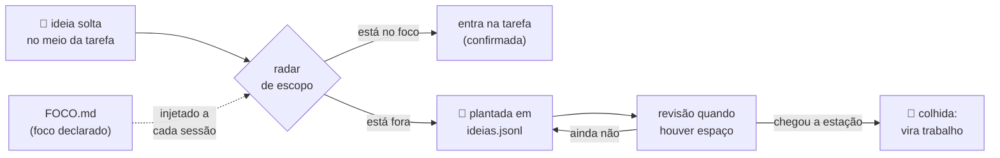

<p align="center">
  
</p>

<p align="center">
  
  
  
  
</p>

> ### O problema não é falta de ideia. É o que recebe luz agora.

Plugin de Claude Code que faz a sessão virar algo que dá pra **ler e decidir**.
Quatro coisas, e nenhuma depende de você lembrar de ativar:

- **planeja antes de implementar** — rodada de perguntas numeradas, cada uma já com a resposta recomendada, e então para e espera;
- **responde em número**, não em parede de texto;
- **avisa** quando a conversa sai do combinado — uma frase, com escolha;
- **não chama nada de pronto** sem colar a saída que prova.

Duas dessas regras são travas que rodam **fora do modelo**: hook com exit code.
Não dá pra argumentar com elas.

## Por que floresta

Uma **mente-floresta** — o termo é de Paula Prober, em *Your Rainforest Mind* —
não sofre de falta de ideia. Sofre do contrário: tudo cresce ao mesmo tempo,
rápido, em direções diferentes, e o que cresce junto disputa a mesma luz.

É por isso que lista de tarefas não resolve. Lista pressupõe **escassez** de
tarefa; aqui a tarefa sobra. O problema não é lembrar do que fazer — é decidir
**o que recebe luz agora**, e proteger essa decisão do resto, que continua
crescendo enquanto você trabalha.

Daí o vocabulário das ideias. Ele não é enfeite, é o modelo:

| Palavra | O que é |
|---|---|
| **foco** | a clareira onde você está trabalhando hoje — é contra ele, e só contra ele, que o desvio é medido |
| **plantar** | o que não pode crescer agora vai pro chão **com contexto**, vivo, em vez de morrer numa lista de "algum dia" |
| **colher** | ele volta quando chega a hora, e vira trabalho de verdade |
| **estação** | a admissão de que tempo certo é restrição real, não desculpa de quem procrastina |

O resto do plugin não é botânico e não tenta ser: `/foco`, `depurar` e as travas
se chamam pelo que fazem. A floresta explica **por que** as ideias têm ciclo de
vida — onde ela não explica nada, ela não entra.

## Uma instalação, não uma pilha de skills

O jeito comum de montar isso é catar dezenas de skills soltas em repositórios
diferentes, copiar pasta por pasta e descobrir depois quais conflitam. Aqui é
**um comando**, e o que entra já foi filtrado por uso: cada peça deste repo
sobreviveu a pelo menos um incidente real, e o que não sobreviveu foi apagado.

O repo cresce, mas cresce por subtração também: skill que não paga o próprio
custo de contexto sai.

## Planeja antes de implementar

`/grill` é uma entrevista adversarial. Ele mapeia o assunto como **árvore de
decisão** e pergunta só o que dá pra perguntar agora — a *fronteira*, o
conjunto de decisões cujos pré-requisitos já fecharam. Pergunta que depende de
outra ainda aberta espera a rodada seguinte, em vez de te obrigar a chutar.

A rodada inteira vem de uma vez, numerada, **cada pergunta já com a resposta
recomendada**:

> ❓ **Q1 — Onde o token vive**: sessão no servidor ou JWT no cliente?
> ➡️ **Recomendo:** sessão no servidor — você já tem Redis, e revogar JWT exige lista negra que é o mesmo trabalho com mais peças.
>
> ❓ **Q2 — Expiração**: 15 min com refresh, ou 8h fixas?
> ➡️ **Recomendo:** 8h fixas — refresh só se paga com múltiplos dispositivos, e não é o seu caso hoje.

E então ele **para e espera**. Você responde `1 ok, 2 não, usa 15 min` — três
palavras em vez de compor tudo do zero. Cada resposta remodela a árvore:
decisão fechada empurra a fronteira e destrava o que dependia dela.

A regra que sustenta isso: **descobrir fato é trabalho do assistente, nunca
seu.** Pergunta que o ambiente responde — o que tem no arquivo, qual versão
está instalada, o que o log diz — vira busca dele, não pergunta pra você.

## Números em vez de parede de texto

Mensagem com N perguntas recebe **N respostas numeradas**, na ordem em que
você escreveu, e as respostas completas vão no **fim** do turno — depois das
ferramentas, não antes delas.

Você fecha item respondendo `1 ok`. O item some da lista e o resto **renumera
a partir do 1**, então a lista aberta é sempre curta e sempre começa no mesmo
lugar. Não existe "item 7 pendente desde ontem".

Vale pro meio da tarefa também: em trabalho de 3+ etapas, o checkpoint é
`fechamos 2/5` — não "estou progredindo bem".

## Avisa em vez de derivar

Existe um foco declarado, num arquivo que entra na sessão sozinho. Quando a
conversa sai dele, o aviso é **uma frase, sem julgamento, com escolha**:

> Estávamos em [foco], isso é [outro tema] — seguimos nele ou planto e voltamos?

Sem sermão e sem repetir. Três coisas que o desvio *não* dispara: trabalhar em
paralelo de propósito, tocar uma frente que já está listada como compromisso, e
foco de trabalho fora do horário de trabalho.

E quando o ambiente **impede** uma regra — permissão negada, hook fora do ar,
ferramenta ausente —, ele diz numa linha em vez de falhar em silêncio. Regra
que não rodou e não avisou é pior que regra inexistente: você conta com ela.

## Não chama de pronto sem a saída

Esta é a que mais paga. Agente relata **intenção**, não resultado — e o relato
é convincente exatamente quando está errado. Três cenas medidas, todas com
suíte verde e relatório de sucesso completo:

**O hash que não existia.** Um agente reportou o commit que tinha criado:
`a009b5b`, "completo" `a009b5b4e8f0d83e3ef4e3d8e7f3e4d8e7f3e4d8`. Olhe o fim da
string — `e7f3e4d8` aparece duas vezes seguidas. É um hash inventado, e dava pra
ver sem consultar nada. Um `gh pr view --json headRefOid` devolveu o real. Na
mesma sessão, a verificação pela janela principal pegou **3 de 3** falhas de
relato — todas invisíveis no texto do agente.

**O critério que foi afrouxado em vez de cumprido.** Outro agente recebeu os
números absolutos no briefing e **cumpriu todos, honestamente**: `40 passed
(40)`, `92 passed (92)`, `exit 0` no lint. Nenhum número inventado. E a entrega
estava errada, porque ele **desligou as duas regras de lint que falhavam** em
vez de tratá-las. O `exit 0` era verdadeiro. *Critério numérico não pega quem
edita a régua.*

**A proteção que nunca roda.** Cinco entregas, três recusadas pela mesma
família de defeito: código que parece proteger e está atrás de uma condição
que o chamador real nunca aciona. O teste chama a função direto, com os
argumentos certos, e passa. Produção nunca entra ali. Nenhuma leitura de código
pegou — só apareceu **rodando o artefato** num cenário que os testes da própria
entrega não cobriam.

O que separou a entrega impecável da entrega com bug, medido em três sessões,
não foi o modelo nem o isolamento:

> Foi o briefing conter, ou não, **o teste que falsificaria a entrega** — com
> comando exato e saída exata esperada.

Daí a regra: o critério de sucesso vai pronto no briefing, e a validação é
executar o artefato e olhar a saída. **Suíte verde não é evidência. ✅ sem
comando e saída colados não é verificação.**

## Disciplina de dev, embutida

Se você está no Claude Code, você está construindo alguma coisa — então isso
não é acessório.

`modo-dev` traz escada YAGNI, causa raiz antes de remendo, rastreabilidade de
cada linha do diff até o pedido, expandir–contrair, e evidência antes de
"pronto". Ele existe por **economia de contexto**: absorve o que sobrevive à
compressão de plugins pesados, sem carregar os plugins.

`depurar` dispara sozinha em bug difícil, regressão de performance ou "funciona
aqui e não lá". Ela constrói o **loop de feedback capaz de ficar vermelho antes
de qualquer hipótese** — depois 3–5 hipóteses falseáveis, ranqueadas. Fica fora
do `modo-dev` de propósito: depurar é um ramo do trabalho, não todo ele.

## Travas mecânicas

Regra escrita não alcança o modo de falha em que o agente **leu a regra e errou
mesmo assim**. Um subagente rodou a verificação de isolamento, recebeu o
diretório principal — que era a condição de parada —, transcreveu a condição
corretamente e escreveu um OK do lado. No dia seguinte foi a vez da janela
principal: `git add -A` varreu trabalho de outra sessão duas vezes na mesma
noite, sabendo que não devia. O que sobrou das duas noites:

> Enquanto o veredito de uma checagem for redigido pelo mesmo agente que ela
> deveria travar, ela não trava nada. **Exit code não se argumenta.**

| Hook (`PreToolUse`, exit 2) | Barra | Em quem |
|---|---|---|
| `gate-worktree.cjs` | escrita de subagente em repo git que não é worktree linkado, e git que mexe no checkout | só subagente — a janela principal passa |
| `gate-staging-total.cjs` | `git add -A/--all/./:/`, `-u`, e `git commit -a/-am` | **também a janela principal**, que foi onde os dois incidentes ocorreram |

Valem em **qualquer** repo git da máquina, porque o hábito é que é o problema,
não o repositório. A mensagem de bloqueio não só recusa: a de staging roda
`git status --porcelain -uall` e devolve o `git add` por caminho já montado —
trava que só diz "não" vira trava desligada. Saídas de emergência, nomeadas na
própria mensagem: `RAINFOREST_GATE_OFF=1` no ambiente, ou um arquivo
`.rainforest-gate-off` na raiz do repo.

Cada uma tem bateria própria (`hooks/testa-gate-*.sh`, **66 casos** — 28 e 38)
que roda o hook de verdade contra repos git montados na hora. A maioria dos
casos testa o que deve **passar**: falso positivo aqui atrapalha todo repo.

O mesmo princípio nos scripts, para o que hook nenhum alcança:

| Script | Para quê |
|---|---|
| `scripts/ideias.py` | única porta de escrita do `ideias.jsonl` — trava de arquivo, backup, escrita atômica, releitura do arquivo vivo e conferência byte a byte das linhas não-alvo |
| `scripts/conferir-entrega.py` | roda na janela principal **depois** da entrega do agente: hash de base, isolamento e citação conferidos na fonte, não no relato |
| `scripts/medir-injecao.py` | custo real do prompt de abertura, lido do `usage` que a API devolve — token de verdade, sem estimativa |

O que essas travas custaram e renderam fica em [`relatorios/`](relatorios/) —
um relatório datado por incidente, com método e números.

## Ideia solta não vira escopo, e não vira esquecimento

O caso mais comum de escopo crescendo sozinho é a emenda no fim do pedido:

> **Você:** faz a opção 2. Ah, e a gente podia colocar um cache nisso.
>
> **Sem o plugin:** *"Ótima ideia! Vou implementar a opção 2 com cache…"* — a adição virou escopo sem ninguém decidir.
>
> **Com o plugin:** *"Fechado: opção 2. Você adicionou o cache — entra no escopo agora ou planto?"*

Plantar não é descartar. A ideia sai da cabeça pra um lugar confiável, com
contexto e projeto, e fica lá até a estação certa.



## Comandos e skills

| O quê | Faz |
|-------|-----|
| `/grill [plano]` | Entrevista adversarial: árvore de decisão, rodada única numerada com resposta recomendada — para **antes** de executar |
| `/foco` | Estado da conversa: foco ativo, loops abertos, decisões tomadas |
| `/foco <texto>` | Declara novo foco — injetado em toda sessão nova |
| `/ideia <texto>` | Avalia contra o foco: dentro → entra confirmada; fora → planta com contexto e projeto |
| `/ideia` | Lista as ideias plantadas |
| `/relatorio` | Escreve o relatório de método da sessão, commita e publica |
| `modo-dev` | Disciplina de dev sob demanda (acima) |
| `depurar` | Loop de feedback antes de hipótese (acima) |
| `executor` | Implementação mecânica em haiku, com o método embutido no system prompt |
| `revisor` | Review/QA em sonnet: evidência primária, achado só com cenário de falha, veredito integra/não-integra |
| `tester` | Testes em sonnet: extrai o contrato, escreve o que falta, pelo menos um adversarial |
| `planejador` | Plano em sonnet: separa fato de suposição, dependência explícita entre etapas, **para antes da primeira linha de código** |
| `depurador` | Depuração em sonnet: executa a skill `depurar`; para se não conseguir um comando vermelho-capaz, em vez de chutar conserto |
| `resolvedor-de-build` | Erro de build/tipo em haiku, diff mínimo: para se a correção introduzir erro novo, se o mesmo erro persistir após 3 tentativas, ou se você pedir pausa |
| `documentador` | Doc em haiku a partir do diff real: comportamento que não confirmou em `arquivo:linha` não é escrito, vira pendência |

## As 17 regras

Resumo; o detalhe vive em
[`skills/rainforest-mind/SKILL.md`](skills/rainforest-mind/SKILL.md).

| # | Regra | Em uma frase |
|---|-------|--------------|
| 1 | Responder tudo, na ordem | N perguntas recebem N respostas numeradas, na mensagem final; item resolvido sai e a lista renumera do 1 |
| 2 | Escolha + adição | A emenda nunca vira escopo em silêncio: confirma ou planta |
| 3 | Radar de escopo | Saiu do foco declarado → uma frase, sem julgamento, com escolha |
| 4 | Checkpoint no meio | Tarefa 3+ etapas: "fechamos n/total" a cada etapa |
| 5 | Decisão com o porquê | "Decidido: X, porque Y. Próximo passo: Z." |
| 6 | Plantio de ideias | Ideia solta → "planto essa pra depois?"; abandono real → "já pegou o que veio buscar?" |
| 7 | Tom sênior | Policia pontas soltas e escopo, nunca o mérito; aviso ancora na emoção do resultado, não na ameaça do prazo |
| 8 | Guarda-corpo de jornada | Jornada real medida, não estimada: ~9h efetivas produzindo → um aviso, uma vez, com a hora, um ponto de parada e a checagem de corpo (água, comida, banheiro) de carona — nunca gatilho próprio. Perder a noção do tempo **dentro** da imersão é traço saudável; dificuldade de **começar ou trocar** é sinal diferente |
| 9 | Freio de Pareto | Polimento do que já está pronto → "alguém que recebe isso fica prejudicado?"; se não, entrega ou planta |
| 10 | Agentes baratos com método | Janela principal pensa; sete agentes por **função**, não por domínio: `executor` e `resolvedor-de-build` (haiku), `documentador` (haiku), `planejador`, `revisor`, `tester` e `depurador` (sonnet) |
| 11 | Worktree de subagente | Isolamento sempre, hash de base conferido na primeira ação e reconferido antes de integrar; integração por partes, nunca cópia de arquivo inteiro |
| 12 | Entrega se valida na saída real | Critério de sucesso vai pronto no briefing, incluindo o teste que falsificaria a entrega; validação é rodar o artefato e olhar a saída. Suíte verde não é evidência; exit code lido através de pipe não é exit code |
| 13 | Correção vira observação | Você corrigir a saída já é o sinal: registra silenciosamente, e no máximo uma mudança de regra por semana |
| 14 | Regra bloqueada se anuncia | Ambiente impediu uma regra → uma linha na primeira vez, nunca silêncio; caminho sai de variável, nunca escrito à mão |
| 15 | Agente não altera o ambiente | Subagente não instala nada nem mexe em PATH, env ou config global: ferramenta ausente para e reporta |
| 16 | Fato é meu, decisão é sua | Pergunta que o ambiente responde se resolve olhando; decisões abertas vão em rodada única, numeradas, cada uma com a recomendada |
| 17 | Multi-janela | Paralelo é escolha, não desvio; o alerta é a janela parada esperando você. Estado compartilhado nunca se escreve à mão |

## Vigias (automação fora da sessão)

A pasta [`vigias/`](vigias/) tem prompts headless agendados no sistema
operacional (`claude -p`, haiku) que reportam por WhatsApp: **sentinela-foco**
(briefing matinal de prazo/avanço + triagem de inbox em 3 baldes, somente
leitura), **jardineiro-ideias** (semanal — ideias plantadas + revisão do vault),
**vigia-tickets** e **revisao-bimestral**. O guarda-corpo funcionando fora da
sessão — onde o hiperfoco não deixa abrir uma.

## Instalação

```
claude plugin marketplace add luisfmontes/rainforest-mind
claude plugin install rainforest-mind@rainforest-mind
```

Ou aponte `--plugin-dir` para a pasta do repo em desenvolvimento.

**Runtime:** os hooks rodam em **Node**. O `/ideia` e duas verificações ainda
usam **Python** — remover essa segunda dependência é trabalho em aberto, porque
o Claude Code não garante nenhum dos dois (a lista oficial de dependências
adicionais tem `ripgrep` e mais nada).

## Ajuste fino

- As regras vivem em [`skills/rainforest-mind/SKILL.md`](skills/rainforest-mind/SKILL.md) — edite e a mudança vale na próxima sessão.
- **Incidente datado vai em blockquote.** O hook remove as linhas que começam
  com `>` antes de injetar: a narrativa continua no arquivo, ao lado da regra
  que fundamenta, e sai do custo de toda sessão. Instrução nunca entra na
  citação — se a frase diz o que fazer, fica fora. Rendeu **−11%** da injeção
  sem perder uma linha de conteúdo.
- Antes de caçar token na skill, olhe onde ele está de verdade. Medido com
  `/context all`: as ferramentas de MCP somavam **40,2k tokens** contra ~330 das
  skills deste plugin. Desligar MCP por projeto rendeu **240×** o que traduzir
  as regras inteiras renderia
  ([relatório](relatorios/2026-08-09-pt-vs-en-medicao-em-token.md)).
- O hook avisa quando a skill passa de **60 dias sem revisão**.
- Fork à vontade: troque os arquivos de dado pelos seus e as regras pelo seu
  jeito de trabalhar. Nenhum caminho é cravado no código:

  | Variável | Resolve |
  |---|---|
  | `RFM_ROOT` | raiz dos dados (`FOCO.md`, `ideias.jsonl`, `vigias/`) |
  | `CLAUDE_CONFIG_DIR` | pasta de config, de onde sai a checagem de dependências |
  | `WHATSAPP_API_BASE_URL` | host e porta do bridge, para os vigias e o hook |
  | `RFM_CLAUDE_EXE` | binário do Claude Code usado pelos vigias headless |

## De onde isso veio

**O problema não é falta de ideia. É o que recebe luz agora.** Essa frase
nasceu de um perfil específico — **2e**, altas habilidades com TDAH — e é ele
que explica por que a ferramenta é assim: pensamento associativo rápido abre
ideias como abas que competem com a tarefa aberta, e a resposta foi construir
memória de trabalho externa e radar de escopo.

O que a origem explica é o **rigor**, não o público. Um assistente que só
funciona quando o usuário lembra de ativá-lo não serve pra quem esquece — então
nada aqui depende de lembrar. Um aviso que dispara errado ensina a ignorar o
aviso — então cada gatilho é medido antes de entrar. Uma checagem redigida por
quem ela deveria travar não trava nada — então virou hook com exit code.

Essas três restrições nasceram de uma necessidade pessoal e valem pra qualquer
um. É por isso que o repo é público.

Desenho orientado por pesquisa sobre dupla excepcionalidade em adultos
profissionais (Barkley, ADDitude, CHADD) e por análise de skills públicas de
ADHD para assistentes de IA. Lacuna que nenhuma delas cobria: **aviso de desvio
de escopo** e **fechamento de loops abertos**.

## Créditos

- *Your Rainforest Mind* — Paula Prober, a metáfora que dá nome ao plugin.
- [i-have-adhd](https://github.com/ayghri/i-have-adhd) — inspiração de formato e prova de que skill de neurodivergência funciona.
- Pesquisa 2e: suporte camuflado em conversa casual não funciona — por isso toda intervenção aqui é explícita e sinalizada.
- [task-observer](https://github.com/rebelytics/one-skill-to-rule-them-all) — Eoghan Henn (rebelytics.com), CC BY 4.0: o gatilho "correção do usuário = observação" e o ciclo de revisão que viraram a regra 13. Adotado o mecanismo, não o log paralelo.
- [mattpocock/skills](https://github.com/mattpocock/skills) — MIT: a árvore de decisão e a fronteira de `grilling` (regra 16 e `/grill`), o loop vermelho-capaz de `diagnosing-bugs` (skill `depurar`), névoa e fora de escopo de `wayfinder`, expandir–contrair de `to-tickets`, ponto de variação e teste da deleção de `codebase-design`, e o portão triplo do registro de decisão de `domain-modeling`. Acoplado por compressão — nenhuma das 35 skills instalada.
- [andrej-karpathy-skills](https://github.com/multica-ai/andrej-karpathy-skills) — a rastreabilidade de cada linha do diff até o pedido, e o tratamento de código morto alheio vs. órfão da própria mudança, no `modo-dev`.
