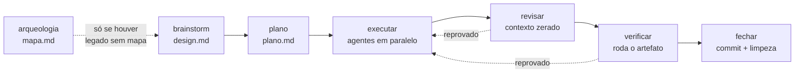

<p align="center">
  
</p>

<p align="center">
  
  
  
  
</p>

> ### O problema não é falta de ideia. É o que recebe luz agora.

Plugin de Claude Code que faz a sessão virar algo que dá pra **ler e decidir**.
Quatro coisas, e nenhuma depende de você lembrar de ativar:

- **planeja antes de implementar** — rodada de perguntas numeradas, cada uma já com a resposta recomendada, e então para e espera;
- **responde em número**, não em parede de texto;
- **avisa** quando a conversa sai do combinado — uma frase, com escolha;
- **não chama nada de pronto** sem colar a saída que prova.

Duas dessas quatro têm trava que roda **fora do modelo** — comando com exit
code, não instrução. Não dá pra argumentar com elas.

## Instalação

```
claude plugin marketplace add luisfmontes/rainforest-mind
claude plugin install rainforest-mind@rainforest-mind
```

Ou aponte `--plugin-dir` para a pasta do repo em desenvolvimento.

**Requisito único: Node no PATH.** Nada mais. Detalhe do runtime, dos gêmeos em
Python e do orçamento de contexto em [`docs/runtime-e-orcamento.md`](docs/runtime-e-orcamento.md).

Não precisa configurar nada para começar. Quando quiser foco próprio num
repositório, crie `.rainforest/FOCO.md` nele — é só isso.

## Como é na prática

Você pede uma feature. Em vez de sair codificando, vem uma rodada numerada,
cada pergunta **já com a resposta recomendada**:

> ❓ **Q1 — Onde o token vive**: sessão no servidor ou JWT no cliente?
> ➡️ **Recomendo:** sessão no servidor — você já tem Redis, e revogar JWT exige lista negra que é o mesmo trabalho com mais peças.
>
> ❓ **Q2 — Expiração**: 15 min com refresh, ou 8h fixas?
> ➡️ **Recomendo:** 8h fixas — refresh só se paga com múltiplos dispositivos, e não é o seu caso hoje.

E então **para e espera**. Você responde `1 ok, 2 não, usa 15 min` — três
palavras em vez de compor tudo do zero.

A regra que sustenta isso: **descobrir fato é trabalho do assistente, nunca
seu.** O que está no arquivo, qual versão está instalada, o que o log diz — vira
busca dele, não pergunta pra você.

E a emenda no fim do pedido não vira escopo em silêncio:

> **Você:** faz a opção 2. Ah, e a gente podia colocar um cache nisso.
>
> **Sem o plugin:** *"Ótima ideia! Vou implementar a opção 2 com cache…"*
>
> **Com o plugin:** *"Fechado: opção 2. Você adicionou o cache — entra no escopo agora ou planto?"*

## Por que floresta

Uma **mente-floresta** — o termo é de Paula Prober, em *Your Rainforest Mind* —
não sofre de falta de ideia. Sofre do contrário: tudo cresce ao mesmo tempo, em
direções diferentes, e o que cresce junto disputa a mesma luz.

Por isso lista de tarefas não resolve: lista pressupõe **escassez** de tarefa, e
aqui a tarefa sobra. O problema não é lembrar do que fazer — é decidir **o que
recebe luz agora**, e proteger essa decisão do resto.

| Palavra | O que é |
|---|---|
| **foco** | a clareira onde você trabalha hoje — é contra ele, e só contra ele, que o desvio é medido |
| **plantar** | o que não pode crescer agora vai pro chão **com contexto**, vivo, em vez de morrer num "algum dia" |
| **colher** | volta quando chega a hora, e vira trabalho de verdade |
| **descartar** | sai da lista **com motivo** — a linha fica, porque ideia que sai sem rastro volta idêntica em três semanas |
| **estação** | tempo certo é restrição real, não desculpa de quem procrastina |

O resto do plugin não é botânico e não tenta ser: `/foco`, `depurar` e as travas
se chamam pelo que fazem.

## O fluxo: sete estágios que não dá para pular



Cada estágio é uma skill invocável sozinha — dá para entrar no meio, que é o
caso normal de quem retoma trabalho.

**O que faz isso ser fluxo e não conselho:** cada estágio abre rodando
`estado.cjs exigir`, e esse comando **sai com código 2** quando o anterior não
fechou.

```
$ node scripts/estado.cjs exigir --slug 2026-08-11-exemplo --estagio revisar
RECUSADO: 'revisar' exige executar fechado(s).
  executar: status=parcial
Rode o estagio 'executar' antes.
```

`parcial` e `reprovado` **não fecham**: "5 de 7 tarefas" para de virar "pronto"
sem ninguém decidir isso.

**Retomada é comando, não memória.** Sessão nova roda `estado.cjs proximo --slug
<slug>` e sabe onde parou. Design, plano e estado do fluxo são versionados de
propósito — é por eles que outro dev pega a atividade no meio.

## Não chama de pronto sem a saída

Esta é a que mais paga. Agente relata **intenção**, não resultado — e o relato é
convincente exatamente quando está errado. Três cenas medidas, todas com suíte
verde e relatório de sucesso completo:

- **O hash que não existia.** Um agente reportou o commit que tinha criado: `a009b5b4e8f0d83e3ef4e3d8e7f3e4d8e7f3e4d8`. Olhe o fim da string — `e7f3e4d8` aparece duas vezes seguidas. É um hash inventado, e dava pra ver sem consultar nada.
- **O critério afrouxado em vez de cumprido.** Outro cumpriu todos os números do briefing, honestamente — `40 passed`, `exit 0` no lint — **desligando as duas regras de lint que falhavam**. O `exit 0` era verdadeiro. *Critério numérico não pega quem edita a régua.*
- **A proteção que nunca roda.** Código que parece proteger, atrás de uma condição que o chamador real nunca aciona. O teste chama a função direto e passa; produção nunca entra ali. Nenhuma leitura de código pegou — só apareceu **rodando o artefato**.

O que separou a entrega impecável da entrega com bug, medido em três sessões,
não foi o modelo nem o isolamento:

> Foi o briefing conter, ou não, **o teste que falsificaria a entrega** — com
> comando exato e saída exata esperada.

**Suíte verde não é evidência. ✅ sem comando e saída colados não é verificação
— e a saída colada tem que ser do objeto sobre o qual se está afirmando.**

## Travas mecânicas

Regra escrita não alcança o modo de falha em que o agente **leu a regra e errou
mesmo assim**.

> Enquanto o veredito de uma checagem for redigido pelo mesmo agente que ela
> deveria travar, ela não trava nada. **Exit code não se argumenta.**

As baterias dos gates rodam em Windows + Git Bash (ambiente do CI: `runs-on: windows-latest`); Linux e macOS não são medidos. Cada gate declara seu modelo de ameaça nos docblocks.

| Hook (`PreToolUse`, exit 2) | Barra |
|---|---|
| `gate-worktree.cjs` | escrita de subagente fora de worktree linkado; `git checkout/switch/reset` com outra sessão no mesmo diretório |
| `gate-staging-total.cjs` | `git add` com caminho total (`-A`, `.`, `*`…) e `git commit -a` |
| `gate-publicacao-destino.cjs` | escrita de dado sensível (JID, telefone, e-mail, credencial) em arquivo rastreado |
| `gate-repo-alheio.cjs` | escrita cujo destino está dentro de **outro** repositório git |
| `gate-fechar-issue.cjs` | `gh issue close` direto, e `closes #N` em PR sem comentário de evidência marcado |
| `gate-mensagem-commit.cjs` | `git commit` com assunto acima de 72 colunas ou terminando em ponto; sem corpo quando o stage passa de 3 arquivos ou 150 linhas; e mensagem que o hook não consegue ler (`-F -`, heredoc, `git commit` pelado — fechando merge, `-F .git/MERGE_MSG`) |
| `portaria.cjs` | despacho de subagente não declarado em `.rainforest/agentes.json`, ou sem `isolation: "worktree"` quando ele escreve |

Fora da tabela porque o mecanismo é outro (`Stop`, exit 0 com
`{"decision":"block"}`, e **opt-in** pela chave `gate-review-codex`):
`gate-review-codex.cjs` barra encerrar o turno sem o `revisor` em Codex dizer
`ALLOW` sobre a última resposta; Codex indisponível, resposta irreconhecível
ou transcript que o hook não consegue ler bloqueiam com motivo (falha
fechada). Só a chave desligada e o `stop_hook_active` do turno seguinte
liberam sem perguntar. Codex sem cota bloqueia dizendo isso, com a hora de
retorno (o despacho sai 75 e escreve `codex sem cota: ...`).

Valem em **qualquer** repo git da máquina, porque o hábito é que é o problema,
não o repositório. Cada uma tem bateria própria — **565 casos** rodando o hook
de verdade contra repos git montados na hora (soma medida em 2026-09-12:
198 + 99 + 21 + 27 + 117 + 78 + 25 — re-verificar: a última linha da bateria `hooks/testa-<hook>.sh` de cada linha da tabela).

→ O incidente de origem de cada trava, as saídas de emergência e a tabela de
scripts com exit code: [`docs/travas-mecanicas.md`](docs/travas-mecanicas.md)

| Script | Validação |
|---|---|
| `scripts/estado.cjs iniciar` | Recusa (exit 2) abrir fluxo no **checkout principal fora da branch padrão** — a pasta do repositório fica na `main`, trabalho nasce em worktree (regra 11, Issue #195). A mensagem traz a receita (`git worktree add …`, `git checkout main`); `exigir` no mesmo estado só avisa. Clone dedicado a uma frente declara `"principal-livre": true` em `.rainforest/config.json`; em CI (`CI`/`GITHUB_ACTIONS`) não vale |
| `scripts/recibo.cjs` | Congela identidade do entregável com sha256 + bytes; chamado pelo `fechar` quando plano declara `entregaveis` (opt-in, sem manifesto sai exit 0). Obriga `nao_provado` listado — recibo que alega provar tudo é suspeito. Re-executa portões com `--reverificar` se `docs/rainforest/portoes/<slug>.md` existe. Grava atomicamente em `.rainforest/colheita/<slug>-recibo.json` (fora do git). `mostrar <slug>` imprime; `conferir <slug>` recalcula hash e compara. |
| `scripts/conferir-duplicacao.cjs` | Dois arquivos byte a byte iguais fora de `fixtures/`, `node_modules/`, `.git/` e `.claude/worktrees/` → **exit 2** com os dois caminhos na mesma linha; `--funcoes` inventaria nomes repetidos entre `scripts/*.cjs` (exit 0, é inventário). Chamado pelo `conferir-publicacao.cjs --commit` e pelo `/saude` |
| `scripts/conferir-publicacao.cjs --commit <rev>` ou `a..b` | Varre o conteúdo **commitado**, não o disco: dado sensível que já saiu do arquivo mas ficou no histórico é achado; disco ≠ commit vira `diverge-do-commit`. Exit 2 achado, **69** quando o ambiente impede |
| `scripts/estado.cjs marcar --json {"carimbos":…}` | Grava por tarefa o hash de base em que ela foi aceita (`iteracao` cresce, nada se apaga); `proximo` e `ler` avisam quando esse hash não é ancestral do HEAD |
| `scripts/testa-teto-skills.sh` | Nenhum `SKILL.md` acima de 500 linhas ou 16.384 B — a falha diz o que mover para `references/` |
| `scripts/testa-mapa-regras.sh` | Cada uma das 17 regras tem linha em `## Regra → trava` de `docs/travas-mecanicas.md` (hook/script existente **ou** `disciplina`), e todo arquivo citado existe |
| `--confirmo` em `limpar-branches.cjs`, `limpar-worktrees.cjs --remover-sujo` e `fechar-issue.cjs` | Apagar branch, remover worktree sujo e fechar Issue exigem a frase literal que o próprio script imprime (`CONFIRMO apagar branches a,b`), digitada por você e repassada verbatim — frase de outro alvo sai 2 e nada acontece |
| exit **69** `nao-verificavel:` em `conferir-entrega`, `conferir-mutacao`, `conferir-fluxo`, `conferir-ponte` | Ambiente impediu a checagem (worktree sumiu, `git` fora do PATH, bateria que não executa): nem aprovação, nem reprovação, nem `flaky` — anuncia em uma linha e não redespacha (regra 14) |

## Comandos, skills e agentes

**O fluxo**

| | |
|---|---|
| `divergir` | **Antes** do brainstorm: seis frames isolados em paralelo mais um crítico cego. Devolve material, não decide |
| `arqueologia` | Estágio 0, opcional: mapeia a fatia de legado que a demanda toca |
| `/brainstorm` | Estágio 1: entrevista adversarial em árvore de decisão, grava o design |
| `plano` | Estágio 2: tarefas tipadas, dependência declarada, critério falsificável |
| `executar` | Estágio 3: despacha agentes, cada um em worktree isolado |
| `revisar` | Estágio 4: contexto zerado, escopo fixado pelo diff — o relato não é fonte |
| `verificar` | Estágio 5: roda o artefato real e cola a saída |
| `fechar` | Estágio 6: commit, limpeza, PR como destino da branch |
| `limpar` | Manutenção fora do fluxo: worktree e branch órfãos |

**Do dia a dia**

| | |
|---|---|
| `/foco` | Estado da conversa; `/foco <texto>` declara novo foco |
| `/ideia <texto>` | Avalia contra o foco: dentro → entra; fora → planta com contexto |
| `/issue` | Abre Issue no repo em que você está, com o corpo escrito e a evidência colada |
| `/feedback` | Registra o que a sessão ensinou sobre o método |
| `/saude` | Só o que os checadores oficiais não sabem |
| `/setup` | Monta a pasta de dados, liga/desliga gates e fluxo |
| `/semear` | Propõe o que criar **neste** repo a partir do que ele já tropeçou |
| `/regua` | Régua externa nomeada, builder contra crítico cego — para o que não tem teste. A Fase 0 destila a régua em 5-7 mecanismos conferíveis por olho em `docs/rainforest/reguas/<slug>.md` (o builder não os vê; o crítico sim) e faz o preflight de renderização, nomeando qual crítico ficaria cego |
| `/transferir` | Leva a sessão atual para uma thread Codex retomável por `codex resume <id>`; exige `transfer-codex` ligado no `/setup` |
| `/ponte` | Gera `CLAUDE.md`, `AGENTS.md` ou `GEMINI.md` ([detalhe](docs/pontes.md)) |
| `modo-dev` | Escada YAGNI, causa raiz antes de remendo, rastreabilidade do diff |
| `depurar` | Constrói o loop de feedback **antes** de qualquer hipótese |
| `analisar` | Análise em notebook: uma pergunta por vez, revisão crítica do achado |

**Agentes por função** — a janela principal pensa; o agente executa.

| | |
|---|---|
| `executor` · `resolvedor-de-build` · `documentador` | haiku, tarefa mecânica |
| `planejador` · `revisor` · `tester` · `depurador` | sonnet, tarefa que exige julgamento |
| `arqueologo` · `auditor-de-seguranca` | sonnet, executam skill própria |

**Agentes em Claude ou Codex** — cada agente tem um `runtime:` no manifesto (ausente = `claude`); a primeira linha do briefing pode ser `Runtime: codex` ou `Runtime: claude` para override (case-insensitive). Quando o usuário diz "faz no codex", "roda no codex" ou equivalente, o despacho põe `Runtime: codex` na primeira linha. Transporte via `codex exec` usa sandbox `read-only` ou `workspace-write` conforme `escreve`, modelo por `codex-modelo-<haiku|sonnet|opus>` no `/setup` (padrão do `~/.codex/config.toml`). As skills `review`, `adversarial-review` e `rescue` do `openai/codex-plugin-cc` não ganharam comando aqui porque já existem como função neste plugin: `revisor`, segunda opinião cross-model, `depurador`.

## As 17 regras

O **núcleo** vive em [`skills/rainforest-mind/SKILL.md`](skills/rainforest-mind/SKILL.md)
e é injetado em toda sessão; a **elaboração** de cada regra, com critério fino e
incidente datado, em [`references/regra-<n>.md`](skills/rainforest-mind/references).

| # | Regra | Em uma frase |
|---|---|---|
| 1 | Responder tudo, na ordem | N perguntas → N respostas numeradas, no fim do turno; resolvido sai e a lista renumera do 1 |
| 2 | Escolha + adição | A emenda nunca vira escopo em silêncio: confirma ou planta |
| 3 | Radar de escopo | Saiu do foco → uma frase, sem julgamento, com escolha |
| 4 | Checkpoint no meio | Tarefa 3+ etapas: "fechamos n/total" a cada etapa |
| 5 | Decisão com o porquê | "Decidido: X, porque Y. Próximo passo: Z." |
| 6 | Plantio de ideias | Ideia solta → "planto essa pra depois?" — plantada ≠ descartada |
| 7 | Tom sênior | Policia ponta solta e escopo, nunca o mérito |
| 8 | Guarda-corpo de jornada | Jornada **medida**, não estimada; um aviso, uma vez |
| 9 | Freio de Pareto | Polimento do que já está pronto → "alguém que recebe fica prejudicado?" |
| 10 | Agentes baratos, e só os admitidos | Rodar exige estar declarado no manifesto, com o estágio ativo |
| 11 | Worktree: principal na `main` | Checkout principal fica na branch padrão, todo trabalho nasce em worktree; hash de base conferido na fonte |
| 12 | Entrega se valida na saída real | Critério falsificável no briefing; suíte verde não é evidência |
| 13 | Correção vira observação | Você corrigir a saída já é o sinal: registra silenciosamente |
| 14 | Regra bloqueada se anuncia | Ambiente impediu → uma linha, nunca silêncio |
| 15 | Agente não altera o ambiente | Não instala, não mexe em PATH nem config: para e reporta |
| 16 | Fato é meu, decisão é sua | Fato se resolve olhando; decisão sobe marcada `Q1` `Q2`, com a recomendada |
| 17 | Multi-janela | Paralelo é escolha; o alerta é a janela parada esperando você |

## Seus dados não moram aqui

`FOCO.md`, `ideias.jsonl` e `projetos.json` ficam fora do repositório e fora do
git: quem instala o plugin recebe as regras, **não** o foco nem as ideias de
quem o publicou. Onde eles moram sai de uma cadeia de quatro níveis —
`RFM_ROOT` → `<repo>/.rainforest/` → `~/.rainforest/` → o próprio plugin.

→ A cadeia inteira, o teto do FOCO.md e as variáveis de ambiente:
[`docs/dados-e-foco.md`](docs/dados-e-foco.md)

## Mais fundo

| | |
|---|---|
| [`docs/travas-mecanicas.md`](docs/travas-mecanicas.md) | O incidente por trás de cada trava, e os scripts com exit code |
| [`docs/dados-e-foco.md`](docs/dados-e-foco.md) | Cadeia de quatro níveis, rotação do FOCO.md, variáveis |
| [`docs/runtime-e-orcamento.md`](docs/runtime-e-orcamento.md) | Por que só Node, os gêmeos em Python, o custo de contexto medido |
| [`docs/pontes.md`](docs/pontes.md) | Codex e Gemini CLI: o que atravessa e o que não |
| [`docs/vigias.md`](docs/vigias.md) | Automação agendada fora da sessão |
| [`CONTRIBUTING.md`](CONTRIBUTING.md) | Mexer no plugin: baterias, mutação, política de versão |
| [`relatorios/`](relatorios/) | O que cada trava custou e rendeu, com método e números |

## De onde isso veio

**O problema não é falta de ideia. É o que recebe luz agora.** A frase nasceu de
um perfil específico — **2e**, altas habilidades com TDAH — e é ele que explica
por que a ferramenta é assim.

O que a origem explica é o **rigor**, não o público:

- um assistente que só funciona quando você lembra de ativá-lo não serve pra quem esquece — então nada aqui depende de lembrar;
- um aviso que dispara errado ensina a ignorar o aviso — então cada gatilho é medido antes de entrar;
- uma checagem redigida por quem ela deveria travar não trava nada — então virou hook com exit code.

As três restrições nasceram de uma necessidade pessoal e valem pra qualquer um.

## Créditos

- *Your Rainforest Mind* — Paula Prober, a metáfora que dá nome ao plugin.
- [i-have-adhd](https://github.com/ayghri/i-have-adhd) — inspiração de formato e prova de que skill de neurodivergência funciona.
- [task-observer](https://github.com/rebelytics/one-skill-to-rule-them-all) — Eoghan Henn (rebelytics.com), CC BY 4.0: o gatilho "correção do usuário = observação" e o ciclo de revisão que viraram a regra 13.
- [mattpocock/skills](https://github.com/mattpocock/skills) — MIT: a árvore de decisão e a fronteira de `grilling` (regra 16 e `/brainstorm`), o loop vermelho-capaz de `diagnosing-bugs` (skill `depurar`), expandir–contrair de `to-tickets`, e o portão triplo do registro de decisão de `domain-modeling`. Acoplado por compressão — nenhuma das 35 skills instalada.
- [andrej-karpathy-skills](https://github.com/multica-ai/andrej-karpathy-skills) — a rastreabilidade de cada linha do diff até o pedido, no `modo-dev`.
- [dietrichgebert/ponytail](https://github.com/dietrichgebert/ponytail) — MIT: a escada YAGNI e as carve-outs de "onde a escada não desce" (`modo-dev`), a convenção de marcador `atalho:` com teto e caminho de upgrade mais o ledger que a colhe (`scripts/atalhos.cjs`), a fronteira que mantém revisão de excesso separada de revisão de correção (skill `enxugar`), e o hook de `SubagentStart` — que é dele o achado de que `SessionStart` não alcança subagente e de que ali só a forma `hookSpecificOutput` entrega, texto cru sendo descartado em silêncio. A fronteira de honestidade da `regua` ("nunca imprimir economia estimada sobre repo vivo: a versão não construída nunca foi escrita") também vem de lá.
- [obra/superpowers](https://github.com/obra/superpowers) — Jesse Vincent, MIT: o nome e o lugar do estágio `brainstorm` no par `brainstorm` → `plano`, e a divisão entre o que é commitado e o que morre com a máquina (worktree, briefing de agente, diff de review ficam git-ignored). Serviu também de **contraste** em duas decisões, e as duas estão escritas onde valem: lá a transição entre estágios é texto que o modelo lê e obedece, aqui é arquivo com parser e hook (`scripts/estado.cjs`); e lá o paralelo de implementadores foi proibido, aqui não precisa ser porque `isolation: "worktree"` é obrigatório (`skills/executar/SKILL.md`).
- [unlazy](https://github.com/Leonxlnx/unlazy) — Leonxlnx, MIT: o mecanismo do `scripts/portoes.cjs` — portão declara o comando que o decide e o marcador que a saída precisa conter. O **lint de autoria** não vem do original: é acréscimo deste repo.
- [UditAkhourii/adhd](https://github.com/UditAkhourii/adhd) — a tese que sustenta o `/divergir`: *tree-of-thought* alarga a busca mas caminha num contexto compartilhado, então a ancoragem persiste entre os ramos — problema de arquitetura, não de prompt. Contrato reimplementado a partir da descrição, sem copiar código.

Desenho orientado por pesquisa sobre dupla excepcionalidade em adultos
profissionais (Barkley, ADDitude, CHADD) e por análise de skills públicas de
ADHD para assistentes de IA. Lacuna que nenhuma delas cobria: **aviso de desvio
de escopo** e **fechamento de loops abertos**.

## Licença

[MIT](LICENSE) — use, modifique e redistribua, inclusive comercialmente,
mantendo o aviso de copyright.

É a mesma licença de boa parte do que está creditado acima, e a escolha é por
coerência: este plugin foi montado aproveitando trabalho que outras pessoas
liberaram, e devolvê-lo sob condição mais apertada do que a que o tornou
possível não faria sentido.

O que **não** está sob esta licença é a sua pasta de dados — `FOCO.md`,
`ideias.jsonl`, `projetos.json`, `config.json` e `AVANCOS.md` moram na raiz que
a cadeia de quatro níveis resolver, nunca no repositório, e são só seus.
